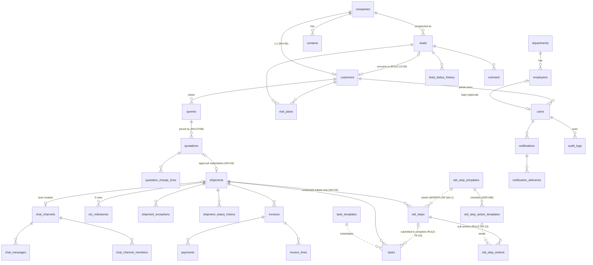

# DATABASE.md
# Consort CRM — Database Schema
**Stack:** PostgreSQL + Prisma ORM 6 (`prisma-client-js`, schema at `erp-backend/prisma/schema.prisma`)
**Authority:** Subordinate to `DECISIONS.md` and `BUSINESS_RULES.md`. The business meaning of every column is defined there; this document defines the shape that stores it.
*Document history lives in git — this file carries no manual version bookkeeping.*

This schema implements the service-driven model: **the services a customer selects (ADR-041) compose the shipment's OTD path (ADR-040)**, `shipments.status` is derived (ADR-014), employees are deactivated never deleted (ADR-045), leads carry an acquisition channel (ADR-042), and Visit Plans are first-class (ADR-043).

---

## 1. Conventions

- **Identifiers.** Every table has a `String @id @default(uuid())` primary key.
- **Naming.** Prisma models are PascalCase with camelCase fields; every model maps to a snake_case table via `@@map`, and multi-word fields map to snake_case columns via `@map` (shown where non-obvious).
- **Timestamps.** Every table has `createdAt DateTime @default(now())`; mutable tables add `updatedAt DateTime @updatedAt`. All timestamps are `timestamptz`.
- **Actors.** Every "who did this" FK points to `users.id` — never to `employees.id` — so portal customers and internal staff audit identically.
- **Reference numbers** (`LED-YYYY-NNNNN`, `CST-`, `QRY-`, `QT-`, `SHIP-`, `INV-`) are allocated from `reference_sequences` inside the owning transaction and are immutable (INV-12).
- **No hard deletes** of business rows. People are deactivated (ADR-045); documents and chat messages soft-delete with `deletedAt`.
- **Optimistic concurrency.** `version Int @default(1)` on `quotations`, `shipments`, `tasks` — bumped on every write, checked by `If-Match`.
- **Money.** `Decimal @db.Decimal(14, 2)`; every money-bearing table carries `currency Char(3)` and the FX rate captured at commit (ADR-006).
- **Phase 2/3 columns exist now and stay null** (CRM_MASTER §2): GPS, load board, bank/LC handshake fields are on `shipments` from day one.

---

## 2. Enums

```prisma
enum UserRole {
  ceo  project_director  director  cfo  gm            // Management tier — identical permissions (ADR-044)
  hr
  asm  bdo                                            // Sales
  ops_manager  ops_exec                               // Operations
  compliance_manager  compliance_exec                 // Compliance
  transport_manager  transport_exec                   // Transport
  accounts                                            // Finance
  customer                                            // External portal
}

enum DepartmentCode { management  sales  operations  compliance  finance  hr  transport }

enum LeadSource   { bdo  bank_lc  direct }            // ADR-042 — immutable (INV-13)
enum LeadStatus   { new  contacted  qualified  converted  lost }

enum OutreachType    { call  email  meeting  whatsapp  linkedin  site_visit }
enum OutreachOutcome { positive  neutral  negative  no_response }

enum VisitPlanStatus { planned  completed  cancelled  no_show }   // ADR-043, WORKFLOW §2a

enum QueryStatus  { open  quoted  revision_requested  approved  shipment_created  rejected  cancelled  expired }
enum RaisedVia    { bdo  portal }

enum QuotationStatus { draft  sent  approved  rejected  expired } // revisions are new rows (ADR-019)
enum ApprovalChannel { customer_portal  asm  management }

enum ServiceCode {                                     // ADR-041 — the Phase-1 catalog, closed
  local_transport  customs_clearance  sea_freight  port_handling  lc_finance
}

enum OtdStepCode {                                     // ADR-003 canonical codes, in canonical order
  order_lock            // step 1  — derives order_confirmed
  order_confirmed       // step 2  — derives order_confirmed
  lc_generated          // step 3
  container_allocated   // step 4
  cro_released          // step 5
  cargo_pickup          // step 6
  customs_entry         // step 7
  inspected_sealed      // step 8
  port_handover         // step 9
  bol_issued            // step 10
  bol_submitted         // step 11
  telex_released        // step 12
  destination_inspection// step 13
  delivered             // step 14
}
enum OtdStepStatus { pending  done }                   // reopen returns a step to pending (RULE-SH-05)

enum ShipmentStatus {                                  // 16 progressive values (ADR-039); DERIVED, never
  booking                                              // written by an endpoint (ADR-014, INV-02).
  order_confirmed  lc_generated  container_allocated  cro_released
  cargo_pickup  customs_entry  inspected_sealed  port_handover
  bol_issued  bol_submitted  telex_released  destination_inspection
  delivered  settled  closed
}
enum ExceptionState { none  on_hold  cancelled }       // orthogonal to progress (RULE-SH-08)
enum ExceptionType  { customs_hold  payment_hold  documentation_hold  weather_hold  customer_request  other }

enum OtcMilestoneType   { invoice_issued  payment_received  credit_line_released  bol_surrendered  settlement_complete }
enum OtcMilestoneStatus { pending  done }

enum InvoiceStatus  { draft  issued  part_paid  paid  void }
enum PaymentMethod  { bank_transfer  cheque  cash  lc_settlement  other }

enum TaskStatus  { queued  open  in_progress  done  cancelled  on_hold }
enum TaskOrigin  { otd_step  query_precheck  ad_hoc  system }

enum DocumentOwnerType { shipment  quotation  query  lead  customer  task  chat_message }
enum ScanStatus        { pending  clean  infected }

enum ChannelType { shipment  department  general  direct }

enum NotificationChannel { in_app  email  whatsapp }   // whatsapp is a Phase-1.5 stub
enum DeliveryStatus      { queued  sent  failed }

enum LoginOutcome { success  invalid_credentials  locked  inactive }
```

---

## 3. Entity-Relationship Overview



---

## 4. Models

### 4.1 Identity & Organisation

```prisma
model Department {
  id         String         @id @default(uuid())
  code       DepartmentCode @unique
  name       String
  headUserId String?        @map("head_user_id")      // departments.head_user_id (CRM_MASTER §4)
  head       User?          @relation("DepartmentHead", fields: [headUserId], references: [id])
  employees  Employee[]
  createdAt  DateTime       @default(now())
  updatedAt  DateTime       @updatedAt
  @@map("departments")
}

model Employee {
  id            String     @id @default(uuid())
  firstName     String     @map("first_name")
  lastName      String     @map("last_name")
  email         String     @unique                    // work email, may differ from login
  phone         String?
  cnic          String?    @unique                    // national ID
  designation   String?
  departmentId  String     @map("department_id")      // INV-01 — exactly one department
  department    Department @relation(fields: [departmentId], references: [id])
  managerId     String?    @map("manager_id")         // cycle-checked in service (RULE-EMP-03)
  manager       Employee?  @relation("Reporting", fields: [managerId], references: [id])
  reports       Employee[] @relation("Reporting")
  joiningDate   DateTime?  @map("joining_date") @db.Date
  exitDate      DateTime?  @map("exit_date") @db.Date // set on deactivation (ADR-045)
  isActive      Boolean    @default(true) @map("is_active")
  user          User?                                  // login is optional (CRM_MASTER §5.2)
  createdAt     DateTime   @default(now())
  updatedAt     DateTime   @updatedAt
  @@index([departmentId])
  @@index([managerId])
  @@map("employees")
}

model User {
  id               String    @id @default(uuid())
  email            String    @unique                  // + raw unique index on lower(email), §5
  passwordHash     String?   @map("password_hash")    // null until activation completes
  role             UserRole                            // INV-01 — exactly one role
  employeeId       String?   @unique @map("employee_id") // internal users
  employee         Employee? @relation(fields: [employeeId], references: [id])
  customerId       String?   @map("customer_id")      // portal users (role = customer)
  customer         Customer? @relation(fields: [customerId], references: [id])
  tokenVersion     Int       @default(0) @map("token_version") // global invalidation (ADR-009)
  isActive         Boolean   @default(true) @map("is_active")
  failedLoginCount Int       @default(0) @map("failed_login_count")
  lockedUntil      DateTime? @map("locked_until")     // account lockout (ADR-033)
  lastLoginAt      DateTime? @map("last_login_at")
  createdAt        DateTime  @default(now())
  updatedAt        DateTime  @updatedAt
  @@index([customerId])
  @@map("users")
}

model RefreshToken {
  id           String    @id @default(uuid())
  userId       String    @map("user_id")
  tokenHash    String    @unique @map("token_hash")   // hashed at rest (ADR-009)
  familyId     String    @map("family_id")            // reuse detection revokes the family (EDGE-A-02)
  deviceLabel  String?   @map("device_label")
  ip           String?
  userAgent    String?   @map("user_agent")
  expiresAt    DateTime  @map("expires_at")
  revokedAt    DateTime? @map("revoked_at")
  replacedById String?   @map("replaced_by_id")
  createdAt    DateTime  @default(now())
  @@index([userId])
  @@index([familyId])
  @@map("refresh_tokens")
}

model ActivationToken {
  id        String    @id @default(uuid())
  userId    String    @map("user_id")
  tokenHash String    @unique @map("token_hash")      // hashed single-use (RULE-EMP-01)
  purpose   String                                     // 'activation' | 'password_reset'
  expiresAt DateTime  @map("expires_at")
  usedAt    DateTime? @map("used_at")
  createdAt DateTime  @default(now())
  @@index([userId])
  @@map("activation_tokens")
}

model LoginActivity {
  id             String       @id @default(uuid())
  userId         String?      @map("user_id")          // null when the email did not resolve
  emailAttempted String       @map("email_attempted")
  outcome        LoginOutcome
  ip             String?
  userAgent      String?      @map("user_agent")
  createdAt      DateTime     @default(now())
  @@index([userId, createdAt])
  @@map("login_activities")
}
```

### 4.2 Company, Contact, Customer

```prisma
model Company {
  id             String    @id @default(uuid())
  name           String
  normalizedName String    @map("normalized_name")     // lower/trimmed — duplicate detection (EDGE-LD-01)
  country        String?
  city           String?
  address        String?
  website        String?
  industry       String?
  contacts       Contact[]
  createdAt      DateTime  @default(now())
  updatedAt      DateTime  @updatedAt
  @@index([normalizedName])
  @@map("companies")
}

model Contact {
  id        String   @id @default(uuid())
  companyId String   @map("company_id")
  company   Company  @relation(fields: [companyId], references: [id])
  name      String
  email     String?
  phone     String?
  position  String?
  isPrimary Boolean  @default(false) @map("is_primary") // partial unique index — INV-05, §5
  createdAt DateTime @default(now())
  updatedAt DateTime @updatedAt
  @@index([companyId])
  @@map("contacts")
}

model Customer {
  id                  String     @id @default(uuid())
  referenceNo         String     @unique @map("reference_no")   // CST-YYYY-NNNNN (INV-12)
  companyId           String     @unique @map("company_id")     // 1:1 (INV-06)
  source              LeadSource                                 // carried from the lead (ADR-042)
  assignedBdoId       String?    @map("assigned_bdo_id")        // users.id
  creditLimit         Decimal?   @map("credit_limit") @db.Decimal(14, 2)
  creditTermsDays     Int?       @map("credit_terms_days")
  convertedFromLeadId String?    @unique @map("converted_from_lead_id")
  isActive            Boolean    @default(true) @map("is_active")
  createdAt           DateTime   @default(now())
  updatedAt           DateTime   @updatedAt
  @@index([assignedBdoId])
  @@map("customers")
}
```

### 4.3 Leads, Outreach, Visit Plans

```prisma
model Lead {
  id                    String     @id @default(uuid())
  referenceNo           String     @unique @map("reference_no") // LED-YYYY-NNNNN
  companyId             String     @map("company_id")           // created once, at lead time (RULE-LD-01)
  contactId             String     @map("contact_id")
  source                LeadSource                               // immutable (INV-13)
  status                LeadStatus @default(new)
  ownerId               String     @map("owner_id")             // owning BDO — users.id
  lostReason            String?    @map("lost_reason")          // mandatory when lost (RULE-LD-06)
  convertedAt           DateTime?  @map("converted_at")
  convertedToCustomerId String?    @unique @map("converted_to_customer_id")
  createdById           String     @map("created_by_id")
  createdAt             DateTime   @default(now())
  updatedAt             DateTime   @updatedAt
  statusHistory         LeadStatusHistory[]
  @@index([ownerId, status])
  @@index([companyId])
  @@map("leads")
}

model LeadStatusHistory {
  id         String     @id @default(uuid())
  leadId     String     @map("lead_id")
  lead       Lead       @relation(fields: [leadId], references: [id])
  fromStatus LeadStatus? @map("from_status")
  toStatus   LeadStatus @map("to_status")
  actorId    String     @map("actor_id")
  notes      String?
  createdAt  DateTime   @default(now())
  @@index([leadId, createdAt])
  @@map("lead_status_history")
}

model Outreach {
  id           String          @id @default(uuid())
  leadId       String?         @map("lead_id")         // exactly one target set — CHECK, §5
  customerId   String?         @map("customer_id")
  type         OutreachType
  outcome      OutreachOutcome
  notes        String?
  durationMin  Int?            @map("duration_min")
  followUpAt   DateTime?       @map("follow_up_at")    // follow-ups-due dashboard
  visitPlanId  String?         @unique @map("visit_plan_id") // set when created by a completed visit (RULE-VP-02)
  actorId      String          @map("actor_id")
  occurredAt   DateTime        @map("occurred_at")
  createdAt    DateTime        @default(now())
  @@index([leadId])
  @@index([customerId])
  @@index([actorId, followUpAt])
  @@map("outreach")
}

model VisitPlan {
  id                String          @id @default(uuid()) // ADR-043
  leadId            String?         @map("lead_id")      // exactly one target set — CHECK, §5
  customerId        String?         @map("customer_id")
  assignedToId      String          @map("assigned_to_id") // BDO/ASM — users.id
  purpose           String
  plannedAt         DateTime        @map("planned_at")
  location          String
  status            VisitPlanStatus @default(planned)
  outcome           String?                               // required on completed (RULE-VP-02)
  outcomeNotes      String?         @map("outcome_notes")
  cancelReason      String?         @map("cancel_reason")
  rescheduledFromId String?         @map("rescheduled_from_id") // prior plan on reschedule
  createdById       String          @map("created_by_id")
  createdAt         DateTime        @default(now())
  updatedAt         DateTime        @updatedAt
  @@index([assignedToId, status, plannedAt])              // upcoming-visits calendar
  @@index([leadId])
  @@index([customerId])
  @@map("visit_plans")
}
```

### 4.4 Query → Quotation

```prisma
model Query {
  id           String        @id @default(uuid())
  referenceNo  String        @unique @map("reference_no")  // QRY-YYYY-NNNNN
  customerId   String        @map("customer_id")
  raisedById   String        @map("raised_by_id")          // BDO or portal user
  raisedVia    RaisedVia     @map("raised_via")
  status       QueryStatus   @default(open)
  services     ServiceCode[]                                // RULE-QRY-05 — non-empty CHECK, §5
  originPort   String?       @map("origin_port")            // validated against ports
  destinationPort String?    @map("destination_port")
  containerTypeCode String?  @map("container_type_code")
  incoterm     String?
  cargoDescription String?   @map("cargo_description")
  weightKg     Decimal?      @map("weight_kg") @db.Decimal(12, 2)
  isHazardous  Boolean       @default(false) @map("is_hazardous") // triggers pre-check (RULE-QRY-02)
  isReefer     Boolean       @default(false) @map("is_reefer")
  cancelReason String?       @map("cancel_reason")          // unserved-demand report (RULE-QRY-03)
  quotations   Quotation[]
  createdAt    DateTime      @default(now())
  updatedAt    DateTime      @updatedAt
  @@index([customerId, status])
  @@index([status, createdAt])                              // staleness sweep (RULE-QRY-04)
  @@map("queries")
}

model Quotation {
  id                String          @id @default(uuid())
  referenceNo       String          @unique @map("reference_no") // QT-YYYY-NNNNN
  queryId           String          @map("query_id")
  query             Query           @relation(fields: [queryId], references: [id])
  version           Int             @default(1)               // revision = new row (ADR-019)
  parentQuotationId String?         @map("parent_quotation_id")
  status            QuotationStatus @default(draft)           // partial uniques INV-07/08, §5
  services          ServiceCode[]                             // snapshot from the query
  currency          String          @default("USD") @db.Char(3)
  fxRate            Decimal?        @map("fx_rate") @db.Decimal(12, 6)
  totalAmount       Decimal         @default(0) @map("total_amount") @db.Decimal(14, 2) // server-computed (RULE-QT-02)
  validityDate      DateTime?       @map("validity_date")     // auto-expiry (RULE-QT-06)
  createdById       String          @map("created_by_id")     // ops_exec / ops_manager
  sentById          String?         @map("sent_by_id")        // ops_manager only (RULE-QT-01)
  sentAt            DateTime?       @map("sent_at")
  decidedById       String?         @map("decided_by_id")     // never the owning BDO (RULE-QT-03)
  decidedAt         DateTime?       @map("decided_at")
  approvalChannel   ApprovalChannel? @map("approval_channel")
  rejectionReason   String?         @map("rejection_reason")  // required on reject (RULE-QT-04)
  rowVersion        Int             @default(1) @map("row_version") // If-Match (RULE-QT-08)
  chargeLines       QuotationChargeLine[]
  createdAt         DateTime        @default(now())
  updatedAt         DateTime        @updatedAt
  @@index([queryId, status])
  @@index([status, validityDate])                             // nightly expiry job
  @@map("quotations")
}

model QuotationChargeLine {
  id          String    @id @default(uuid())
  quotationId String    @map("quotation_id")
  quotation   Quotation @relation(fields: [quotationId], references: [id])
  service     ServiceCode?                                    // which service this charge belongs to
  description String
  quantity    Decimal   @default(1) @db.Decimal(12, 2)
  unitPrice   Decimal   @map("unit_price") @db.Decimal(14, 2)
  amount      Decimal   @db.Decimal(14, 2)                    // computed server-side
  sortOrder   Int       @default(0) @map("sort_order")
  @@index([quotationId])
  @@map("quotation_charge_lines")
}
```

### 4.5 Shipment, OTD, OTC, Exceptions

```prisma
model OtdStepTemplate {
  id             String         @id @default(uuid())    // DB form of WORKFLOW §4a.1 — seeded, read by
  canonicalNo    Int            @unique @map("canonical_no") // the composition logic at approval time
  stepCode       OtdStepCode    @unique @map("step_code")
  title          String
  ownerDepartment DepartmentCode @map("owner_department")    // ADR-003/039 ownership
  always         Boolean        @default(false)         // steps 1–2 and 14 (RULE-SVC-01)
  services       ServiceCode[]                          // included when selection intersects (ADR-040)
  requiredDocTypes String[]     @map("required_doc_types")   // RULE-SH-06
  derivedStatus  ShipmentStatus @map("derived_status")  // what completing this step derives
  active         Boolean        @default(true)          // superseded steps are kept, not deleted (ADR-048)
  actions        OtdStepActionTemplate[]
  @@map("otd_step_templates")
}

// The sub-action checklist that hangs under one main step (ADR-048, WORKFLOW §4a.2).
// Gated by the same three gates as the step catalog, which is how ONE order_confirmed
// step carries two different document packs.
model OtdStepActionTemplate {
  id         String         @id @default(uuid())
  stepCode   OtdStepCode    @map("step_code")
  step       OtdStepTemplate @relation(fields: [stepCode], references: [stepCode], onDelete: Cascade)
  actionCode String         @map("action_code")          // unique within the step
  title      String
  kind       StepActionKind @default(manual)             // manual | document
  docType    String?        @map("doc_type")             // required when kind = document
  sortOrder  Int            @map("sort_order")
  required   Boolean        @default(true)               // false = advisory; does not gate
  packages   ServicePackage[]                            // empty = any package
  croModes   CroHandling[]  @map("cro_modes")
  services   ServiceCode[]
  @@unique([stepCode, actionCode])
  @@index([stepCode])
  @@map("otd_step_action_templates")
}

model Shipment {
  id               String         @id @default(uuid())
  referenceNo      String         @unique @map("reference_no") // SHIP-YYYY-NNNNN
  quotationId      String         @unique @map("quotation_id") // INV-03 — exactly one approved quote
  queryId          String         @unique @map("query_id")
  customerId       String         @map("customer_id")
  services         ServiceCode[]                          // FROZEN at approval (INV-14) — non-empty CHECK, §5
  status           ShipmentStatus @default(booking)       // DERIVED (ADR-014, INV-02)
  exceptionState   ExceptionState @default(none) @map("exception_state") // orthogonal (RULE-SH-08)
  totalHoldMinutes Int            @default(0) @map("total_hold_minutes")
  etd              DateTime?
  eta              DateTime?                              // ETA-breach sweep
  originPort       String?        @map("origin_port")
  destinationPort  String?        @map("destination_port")
  incoterm         String?
  cancelReason     String?        @map("cancel_reason")   // RULE-SH-11
  closedById       String?        @map("closed_by_id")    // ops_manager / Management (RULE-SH-12)
  closedAt         DateTime?      @map("closed_at")
  rowVersion       Int            @default(1) @map("row_version")
  // ── Phase 2/3 — present now, null until then (CRM_MASTER §2/§10) ──
  vehicleId        String?        @map("vehicle_id")      // TMS
  gpsDeviceId      String?        @map("gps_device_id")   // telematics
  loadBoardRef     String?        @map("load_board_ref")  // load board
  lcNumber         String?        @map("lc_number")       // bank/LC handshake
  bankRef          String?        @map("bank_ref")
  escrowRef        String?        @map("escrow_ref")
  otdSteps         OtdStep[]
  otcMilestones    OtcMilestone[]
  exceptions       ShipmentException[]
  statusHistory    ShipmentStatusHistory[]
  invoices         Invoice[]
  createdAt        DateTime       @default(now())
  updatedAt        DateTime       @updatedAt
  @@index([customerId, status])
  @@index([status, exceptionState])
  @@index([eta])
  @@map("shipments")
}

model OtdStep {
  id             String        @id @default(uuid())
  shipmentId     String        @map("shipment_id")
  shipment       Shipment      @relation(fields: [shipmentId], references: [id])
  canonicalNo    Int           @map("canonical_no")     // 1..14 — reporting key (RULE-SVC-05)
  displayNo      Int           @map("display_no")       // 1..N of the composed path
  stepCode       OtdStepCode   @map("step_code")
  ownerDepartment DepartmentCode @map("owner_department") // completion guard (RULE-SH-04)
  status         OtdStepStatus @default(pending)
  completedById  String?       @map("completed_by_id")
  completedAt    DateTime?     @map("completed_at")
  forced         Boolean       @default(false)          // out-of-order override (RULE-SH-03)
  forceReason    String?       @map("force_reason")
  reopenCount    Int           @default(0) @map("reopen_count") // RULE-SH-05
  actions        OtdStepAction[]                        // the step's checklist (ADR-048)
  @@unique([shipmentId, canonicalNo])                   // rows exist ONLY for the composed path (INV-04)
  @@unique([shipmentId, stepCode])
  @@index([shipmentId, status])
  @@map("otd_steps")
}

// One shipment's copy of a checklist item. `status` is meaningful for `manual` items
// ONLY — a `document` item's satisfaction is derived from the shipment's files at read
// time and folded into RULE-SH-06, so it can never drift from the files on record.
model OtdStepAction {
  id            String         @id @default(uuid())
  otdStepId     String         @map("otd_step_id")
  otdStep       OtdStep        @relation(fields: [otdStepId], references: [id], onDelete: Cascade)
  actionCode    String         @map("action_code")
  title         String
  kind          StepActionKind @default(manual)
  docType       String?        @map("doc_type")
  sortOrder     Int            @map("sort_order")
  required      Boolean        @default(true)
  status        OtdStepStatus  @default(pending)        // `manual` only — RULE-SH-13
  completedById String?        @map("completed_by_id")
  completedAt   DateTime?      @map("completed_at")
  notes         String?
  @@unique([otdStepId, actionCode])
  @@index([otdStepId])
  @@map("otd_step_actions")
}

model ShipmentStatusHistory {
  id         String         @id @default(uuid())
  shipmentId String         @map("shipment_id")
  shipment   Shipment       @relation(fields: [shipmentId], references: [id])
  fromStatus ShipmentStatus? @map("from_status")
  toStatus   ShipmentStatus @map("to_status")
  actorId    String?        @map("actor_id")            // null for system recompute
  createdAt  DateTime       @default(now())
  @@index([shipmentId, createdAt])
  @@map("shipment_status_history")
}

model ShipmentException {
  id              String        @id @default(uuid())
  shipmentId      String        @map("shipment_id")
  shipment        Shipment      @relation(fields: [shipmentId], references: [id])
  type            ExceptionType
  reason          String
  raisedById      String        @map("raised_by_id")
  raisedAt        DateTime      @default(now()) @map("raised_at")
  resolvedById    String?       @map("resolved_by_id")
  resolvedAt      DateTime?     @map("resolved_at")
  resolutionNotes String?       @map("resolution_notes")
  holdMinutes     Int?          @map("hold_minutes")     // elapsed, computed on resume (RULE-SH-10)
  @@index([shipmentId])
  @@map("shipment_exceptions")
}

model OtcMilestone {
  id            String             @id @default(uuid())
  shipmentId    String             @map("shipment_id")
  shipment      Shipment           @relation(fields: [shipmentId], references: [id])
  milestoneNo   Int                @map("milestone_no")   // 1..5, seeded at approval (RULE-QT-07)
  type          OtcMilestoneType
  status        OtcMilestoneStatus @default(pending)
  amount        Decimal?           @db.Decimal(14, 2)     // display mirror only (ADR-006)
  completedById String?            @map("completed_by_id") // null when auto (RULE-FI-02/03)
  completedAt   DateTime?          @map("completed_at")
  @@unique([shipmentId, milestoneNo])
  @@map("otc_milestones")
}
```

### 4.6 Finance

```prisma
model Invoice {
  id          String        @id @default(uuid())
  referenceNo String        @unique @map("reference_no") // INV-YYYY-NNNNN
  shipmentId  String        @map("shipment_id")
  shipment    Shipment      @relation(fields: [shipmentId], references: [id])
  quotationId String        @map("quotation_id")         // auto-drafted from it (RULE-FI-01)
  status      InvoiceStatus @default(draft)
  currency    String        @db.Char(3)
  fxRate      Decimal?      @map("fx_rate") @db.Decimal(12, 6) // captured at commit (ADR-006)
  totalAmount Decimal       @map("total_amount") @db.Decimal(14, 2)
  issuedById  String?       @map("issued_by_id")         // accounts
  issuedAt    DateTime?     @map("issued_at")
  dueDate     DateTime?     @map("due_date")             // overdue sweep
  voidedById  String?       @map("voided_by_id")         // only while unpaid (RULE-FI-05)
  voidedAt    DateTime?     @map("voided_at")
  voidReason  String?       @map("void_reason")
  lines       InvoiceLine[]
  payments    Payment[]
  createdAt   DateTime      @default(now())
  updatedAt   DateTime      @updatedAt
  @@index([shipmentId])
  @@index([status, dueDate])
  @@map("invoices")
}

model InvoiceLine {
  id          String  @id @default(uuid())
  invoiceId   String  @map("invoice_id")
  invoice     Invoice @relation(fields: [invoiceId], references: [id])
  description String
  quantity    Decimal @default(1) @db.Decimal(12, 2)
  unitPrice   Decimal @map("unit_price") @db.Decimal(14, 2)
  amount      Decimal @db.Decimal(14, 2)
  sortOrder   Int     @default(0) @map("sort_order")
  @@index([invoiceId])
  @@map("invoice_lines")
}

model Payment {
  id              String        @id @default(uuid())
  invoiceId       String        @map("invoice_id")
  invoice         Invoice       @relation(fields: [invoiceId], references: [id])
  amount          Decimal       @db.Decimal(14, 2)
  method          PaymentMethod
  referenceNumber String?       @map("reference_number")  // bank ref / cheque no
  fxRate          Decimal?      @map("fx_rate") @db.Decimal(12, 6)
  receivedAt      DateTime      @map("received_at")
  recordedById    String        @map("recorded_by_id")
  createdAt       DateTime      @default(now())
  @@index([invoiceId])
  @@map("payments")
}
```

### 4.7 Action Engine & Tasks

```prisma
model TaskTemplate {
  id               String         @id @default(uuid())
  eventCode        String         @map("event_code")    // from the closed catalog (ADR-020)
  stepCode         OtdStepCode?   @map("step_code")     // fires only if on the composed path (RULE-AE-07)
  title            String
  description      String?
  department       DepartmentCode
  dueOffsetHours   Int            @map("due_offset_hours")
  requiredDocTypes String[]       @map("required_doc_types")
  isActive         Boolean        @default(true) @map("is_active")
  createdAt        DateTime       @default(now())
  updatedAt        DateTime       @updatedAt
  @@index([eventCode, isActive])
  @@map("task_templates")
}

model Task {
  id               String      @id @default(uuid())
  idempotencyKey   String      @unique @map("idempotency_key") // replay-safe upsert (RULE-AE-04)
  origin           TaskOrigin
  templateId       String?     @map("template_id")
  shipmentId       String?     @map("shipment_id")
  queryId          String?     @map("query_id")          // compliance pre-check (RULE-QRY-02)
  otdStepId        String?     @map("otd_step_id")       // submitting completes the step (RULE-TK-02)
  title            String
  description      String?
  departmentId     String      @map("department_id")     // RULE-TK-01
  assigneeId       String?     @map("assignee_id")       // null = department queue (RULE-AE-03)
  status           TaskStatus  @default(open)
  statusBeforeHold TaskStatus? @map("status_before_hold") // ADR-038 — held iff sla_paused_at set
  slaPausedAt      DateTime?   @map("sla_paused_at")
  dueDate          DateTime?   @map("due_date")           // shifted by hold_minutes on resume (RULE-SH-10)
  completedById    String?     @map("completed_by_id")
  completedAt      DateTime?   @map("completed_at")
  cancelReason     String?     @map("cancel_reason")
  rowVersion       Int         @default(1) @map("row_version")
  createdAt        DateTime    @default(now())
  updatedAt        DateTime    @updatedAt
  @@index([assigneeId, status])
  @@index([departmentId, status])                          // department queue
  @@index([shipmentId])
  @@index([status, dueDate])                               // overdue sweep
  @@map("tasks")
}

model OutboxEvent {
  id            String    @id @default(uuid())
  eventType     String    @map("event_type")               // closed catalog (ADR-020)
  payload       Json
  correlationId String    @map("correlation_id")
  dispatchedAt  DateTime? @map("dispatched_at")
  attempts      Int       @default(0)
  lastError     String?   @map("last_error")
  createdAt     DateTime  @default(now())
  @@index([dispatchedAt, createdAt])                       // relay poll (ADR-021)
  @@map("outbox_events")
}
```

### 4.8 Documents

```prisma
model Document {
  id            String            @id @default(uuid())
  ownerType     DocumentOwnerType @map("owner_type")     // polymorphic (RULE-DOC-03)
  ownerId       String            @map("owner_id")
  fileName      String            @map("file_name")
  mimeType      String            @map("mime_type")
  sizeBytes     Int               @map("size_bytes")
  checksum      String                                    // dedup (RULE-DOC-02)
  storageKey    String            @unique @map("storage_key")
  docType       String?           @map("doc_type")        // 'gd' | 'bol' | 'pod' | … (RULE-SH-06)
  isPublished   Boolean           @default(false) @map("is_published") // INV-10 — internal by default
  publishedById String?           @map("published_by_id")
  publishedAt   DateTime?         @map("published_at")
  scanStatus    ScanStatus        @default(pending) @map("scan_status")
  uploadedById  String            @map("uploaded_by_id")
  deletedAt     DateTime?         @map("deleted_at")      // soft delete (RULE-DOC-04)
  createdAt     DateTime          @default(now())
  @@index([ownerType, ownerId])
  @@index([checksum])
  @@map("documents")
}
```

### 4.9 Chat

```prisma
model ChatChannel {
  id           String      @id @default(uuid())
  type         ChannelType
  name         String?
  shipmentId   String?     @unique @map("shipment_id")   // auto-created at shipment birth (RULE-QT-07)
  departmentId String?     @map("department_id")
  members      ChatChannelMember[]
  messages     ChatMessage[]
  createdAt    DateTime    @default(now())
  @@map("chat_channels")
}

model ChatChannelMember {
  id                String      @id @default(uuid())
  channelId         String      @map("channel_id")
  channel           ChatChannel @relation(fields: [channelId], references: [id])
  userId            String      @map("user_id")           // customers never members (INV-11) — app guard
  joinedAt          DateTime    @default(now()) @map("joined_at")
  leftAt            DateTime?   @map("left_at")           // set on offboarding (RULE-EMP-05)
  lastReadMessageId String?     @map("last_read_message_id") // unread counts
  @@unique([channelId, userId])
  @@index([userId])
  @@map("chat_channel_members")
}

model ChatMessage {
  id              String      @id @default(uuid())
  channelId       String      @map("channel_id")
  channel         ChatChannel @relation(fields: [channelId], references: [id])
  senderId        String      @map("sender_id")
  clientMessageId String      @map("client_message_id")   // idempotent sends (RULE-CH-02)
  body            String
  replyToId       String?     @map("reply_to_id")
  editedAt        DateTime?   @map("edited_at")
  deletedAt       DateTime?   @map("deleted_at")          // soft delete
  createdAt       DateTime    @default(now())
  @@unique([channelId, clientMessageId])
  @@index([channelId, createdAt])
  @@map("chat_messages")
}
```

### 4.10 Notifications

```prisma
model Notification {
  id        String    @id @default(uuid())
  userId    String    @map("user_id")
  type      String                                        // event code, e.g. 'task.assigned'
  title     String
  body      String?
  priority  Int       @default(0)
  actionUrl String?   @map("action_url")
  groupKey  String?   @map("group_key")
  readAt    DateTime? @map("read_at")
  createdAt DateTime  @default(now())
  deliveries NotificationDelivery[]
  @@index([userId, readAt, createdAt])
  @@map("notifications")
}

model NotificationDelivery {
  id             String              @id @default(uuid())
  notificationId String              @map("notification_id")
  notification   Notification        @relation(fields: [notificationId], references: [id])
  channel        NotificationChannel
  status         DeliveryStatus      @default(queued)     // "I never received it" is answerable (RULE-NT-03)
  sentAt         DateTime?           @map("sent_at")
  error          String?
  @@index([notificationId])
  @@map("notification_deliveries")
}

model NotificationPreference {
  id      String              @id @default(uuid())
  userId  String              @map("user_id")
  type    String                                          // 'task.assigned' & 'shipment.held' cannot be
  channel NotificationChannel                             // disabled — app-enforced (RULE-NT-01)
  enabled Boolean             @default(true)
  @@unique([userId, type, channel])
  @@map("notification_preferences")
}
```

### 4.11 Audit & Reference Data

```prisma
model AuditLog {
  id            String   @id @default(uuid())            // written once, by the global interceptor
  actorId       String?  @map("actor_id")                // (INV-15); null for system jobs
  action        String                                    // 'shipment.step.complete', …
  resourceType  String   @map("resource_type")
  resourceId    String   @map("resource_id")
  diff          Json?                                     // field-level before/after
  ip            String?
  correlationId String   @map("correlation_id")
  createdAt     DateTime @default(now())
  @@index([resourceType, resourceId, createdAt])
  @@index([actorId, createdAt])
  @@map("audit_logs")
}

model ReferenceSequence {
  id        String @id @default(uuid())
  entity    String                                        // 'lead' | 'customer' | 'query' | 'quotation' | 'shipment' | 'invoice'
  year      Int
  lastValue Int    @default(0) @map("last_value")         // allocated inside the owning transaction
  @@unique([entity, year])
  @@map("reference_sequences")
}

model Port {
  code    String  @id                                     // UN/LOCODE
  name    String
  country String
  @@map("ports")
}

model ContainerType {
  code  String @id                                        // '20GP', '40HC', 'REEFER20', …
  label String
  @@map("container_types")
}
```

---

## 5. Database-level constraints Prisma cannot express

Applied in a raw SQL migration, immediately after `prisma migrate`:

```sql
-- Case-insensitive unique login (EDGE-A-01 relies on one row per email)
CREATE UNIQUE INDEX users_email_lower_uq ON users (lower(email));

-- INV-05 — one primary contact per company
CREATE UNIQUE INDEX contacts_one_primary_uq
  ON contacts (company_id) WHERE is_primary;

-- INV-07 — at most one live (draft or sent) quotation per query
CREATE UNIQUE INDEX quotations_one_live_uq
  ON quotations (query_id) WHERE status IN ('draft', 'sent');

-- INV-08 — at most one approved quotation per query
CREATE UNIQUE INDEX quotations_one_approved_uq
  ON quotations (query_id) WHERE status = 'approved';

-- RULE-QRY-05 / INV-14 — services can never be empty
ALTER TABLE queries    ADD CONSTRAINT queries_services_nonempty   CHECK (cardinality(services) > 0);
ALTER TABLE quotations ADD CONSTRAINT quotations_services_nonempty CHECK (cardinality(services) > 0);
ALTER TABLE shipments  ADD CONSTRAINT shipments_services_nonempty  CHECK (cardinality(services) > 0);

-- Outreach / Visit Plans target exactly one of lead, customer
ALTER TABLE outreach    ADD CONSTRAINT outreach_one_target
  CHECK (num_nonnulls(lead_id, customer_id) = 1);
ALTER TABLE visit_plans ADD CONSTRAINT visit_plans_one_target
  CHECK (num_nonnulls(lead_id, customer_id) = 1);

-- ADR-038 — a task is held iff sla_paused_at is set (both columns set or both null)
ALTER TABLE tasks ADD CONSTRAINT tasks_hold_pair
  CHECK ((sla_paused_at IS NULL) = (status_before_hold IS NULL));

-- Positive money
ALTER TABLE payments      ADD CONSTRAINT payments_amount_positive     CHECK (amount > 0);
ALTER TABLE invoice_lines ADD CONSTRAINT invoice_lines_amount_nonneg  CHECK (amount >= 0);
```

Two invariants stay **application-enforced** (documented, not encodable as constraints): customers never join chat channels (INV-11 — the membership guard checks `users.role`), and `shipments.status` is only ever written by the derive routine inside the step-completion transaction (INV-02 — no route exposes it).

---

## 6. Index strategy

Beyond the per-model indexes above, the rule is: **every FK, every `(owner, status)` list pattern, and every scheduled-job scan path is indexed.** The scheduled jobs (WORKFLOW §14) each have a covering index: quotation expiry `(status, validity_date)`, task overdue `(status, due_date)`, lead/query staleness `(status, created_at)`, invoice overdue `(status, due_date)`, ETA breach `(eta)`, outbox relay `(dispatched_at, created_at)`. Add indexes only against a measured slow query — write amplification is real.

---

## 7. Retention policy

Applied by the weekly pruning job (WORKFLOW §14). **Business records are permanent** — leads, customers, queries, quotations, shipments, steps, milestones, invoices, payments, audit logs are never pruned.

| Table | Retention | Action |
|---|---|---|
| `outbox_events` | 30 days after dispatch | delete (nightly reaper) |
| `login_activities` | 12 months | delete |
| `refresh_tokens` | 30 days after expiry/revocation | delete |
| `activation_tokens` | 7 days after use/expiry | delete |
| `notifications` + deliveries | 6 months after read; 12 months unread | delete |
| `chat_messages` (soft-deleted) | body scrubbed 30 days after `deleted_at` | scrub, keep row |
| `documents` (soft-deleted) | storage object removed 30 days after `deleted_at`; orphans after 24 h (EDGE-D-04) | delete object, keep row |
| `audit_logs` | forever | — |

---

## 8. Seed data

Seeded by `prisma/seed.js`, idempotent (upsert by natural key):

1. **Departments** — the seven codes with display names.
2. **`otd_step_templates`** — 26 rows, the DB form of `WORKFLOW.md §4a.1`, read by the composition logic at quote approval (RULE-SVC-01). **`WORKFLOW.md §4a.1` is the single source; the catalog is deliberately not duplicated here.** Each row carries the three gates (`packages`, `cro_modes`, `services`), its `required_doc_types`, `due_offset_hours` and `derived_status`, plus `active` — superseded rows (`container_allocated`, `destination_inspection`, `customs_entry`, `inspected_sealed`) are **kept with `active: false`**, never deleted, because `missing_required_docs` and `recompute_status` resolve templates by `step_code` for shipments that already ran them (ADR-048).
3. **`otd_step_action_templates`** — 16 rows, the sub-action checklists that hang under a main step (ADR-048, `WORKFLOW.md §4a.2`). Gated by the same three gates as steps, which is how one `order_confirmed` row carries the seven-document international pack and the shorter loading-point-to-port pack. Materialised per shipment into `otd_step_actions` at approval; `document` items are derived from the shipment's files at read time and never stored as satisfied.
4. **`task_templates`** — one per **active** composable step (`shipment.step.completed:<code>` → next step's task) plus the pre-check (`query.hazardous` → compliance), invoice-chase (`invoice.overdue`), and the `quotation.approved` fan-out. A superseded step gets no template, so nothing can raise its task.
5. **Reference data** — `ports` (UN/LOCODE subset served), `container_types` (`20GP`, `40GP`, `40HC`, `REEFER20`, `REEFER40`, …).
6. **Bootstrap users** — one Management account per role for staging; production seeds only the first CEO + HR, who create the rest through the app (RULE-EMP-01).

The catalogs (1–4) and the accounts can each be reseeded **on their own**, without the wipe that `node prisma/seed.js` performs: `--templates-only` replaces the step / sub-action / task / charge catalogs in one transaction, `--accounts-only` upserts the role logins. Adding a sub-action to an existing shipment's step is then `node scripts/backfillStepActions.js --apply` (idempotent, dry-run by default).

---

## 9. Migration workflow

- Schema changes go through `prisma migrate dev` locally, `prisma migrate deploy` in CI — never `db push` against a shared database.
- Raw-SQL constraints (§5) live in a migration created with `prisma migrate dev --create-only`, edited before applying, so they replay on every fresh environment.
- Enum growth (a new `ServiceCode`, a new role) is additive-only in Phase 1; removal or rename requires an ADR because enums are the contracts surface (ADR-005/041).
- Every migration must leave `prisma migrate diff` clean against `schema.prisma`.

---

*Every table in this document exists to serve a rule in `BUSINESS_RULES.md` or a machine in `WORKFLOW.md`; a column with no citing rule is a smell. The composition seed in §8 is the single DB source of the service→step mapping — the application must never hard-code it a second time (ADR-001).*
