# WORKFLOW.md
# Consort CRM — State Machines, Events & Sequences
**Authority:** Subordinate to `DECISIONS.md`. Transition *rules* live in `BUSINESS_RULES.md`; this document defines the *shapes*.
*Document history lives in git — this file carries no manual version bookkeeping.*

---

## 1. End-to-End Flow

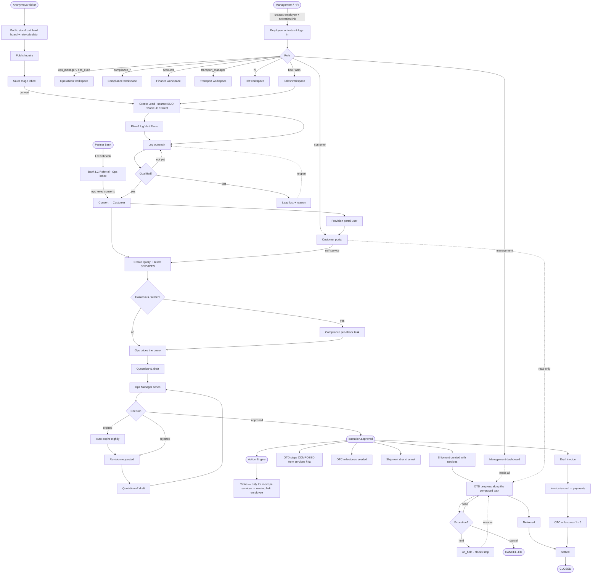
```mermaid
flowchart TD
    A([Management / HR]) -->|creates employee + activation link| B[Employee activates & logs in]
    B --> C{Role}

    C -->|bdo / asm| D[Sales workspace]
    C -->|ops_manager / ops_exec| E[Operations workspace]
    C -->|compliance_*| F[Compliance workspace]
    C -->|accounts| G[Finance workspace]
    C -->|transport_manager| T[Transport workspace]
    C -->|hr| HR[HR workspace]
    C -->|management| H[Management dashboard]
    C -->|customer| I[Customer portal]

    %% ── Three acquisition-channel intakes (CRM_MASTER §5.4/§5.20/§5.21) ──
    ANON([Anonymous visitor]) --> SF[Public storefront: load board + rate calculator]
    SF --> INQ[Public Inquiry]
    INQ --> TRI[Sales triage inbox]
    TRI -->|convert| J
    BANK([Partner bank]) -->|LC webhook| LCR[Bank LC Referral · Ops inbox]
    LCR -->|ops_exec converts| M

    D --> J[Create Lead · source: BDO / Bank LC / Direct]
    J --> VP[Plan & log Visit Plans]
    VP --> K
    J --> K[Log outreach]
    K --> L{Qualified?}
    L -->|not yet| K
    L -->|lost| LOST[Lead lost + reason]
    LOST -.reopen.-> K
    L -->|yes| M[Convert → Customer]
    M --> PU[Provision portal user]
    PU --> I

    M --> N[Create Query + select SERVICES]
    I -->|self-service| N
    N --> HAZ{Hazardous / reefer?}
    HAZ -->|yes| CPC[Compliance pre-check task]
    HAZ -->|no| O
    CPC --> O[Ops prices the query]

    O --> P[Quotation v1 draft]
    P --> PS[Ops Manager sends]
    PS --> Q{Decision}
    Q -->|expired| EXP[Auto-expire nightly]
    EXP --> R
    Q -->|rejected| R[Revision requested]
    R --> P2[Quotation v2 draft] --> PS
    Q -->|approved| S([quotation.approved])

    S --> S1[Shipment created with services]
    S --> S2[OTD steps COMPOSED from services §4a]
    S --> S3[OTC milestones seeded]
    S --> S4[Shipment chat channel]
    S --> S5[Draft invoice]
    S --> S6([Action Engine])

    S6 --> TA[Tasks — only for in-scope services → owning field employee]
    S1 --> Z[OTD progress along the composed path]
    Z --> EX{Exception?}
    EX -->|hold| HOLD[on_hold · clocks stop] -.resume.-> Z
    EX -->|cancel| CAN([CANCELLED])
    EX -->|none| Z

    Z --> DEL[Delivered]
    S5 --> INV[Invoice issued → payments]
    INV --> AA[OTC milestones 1→5]
    DEL --> SET
    AA --> SET[settled]
    SET --> CL([CLOSED])

    H -.reads all.-> Z
    I -.read-only.-> Z
```

---

## 2. Lead State Machine

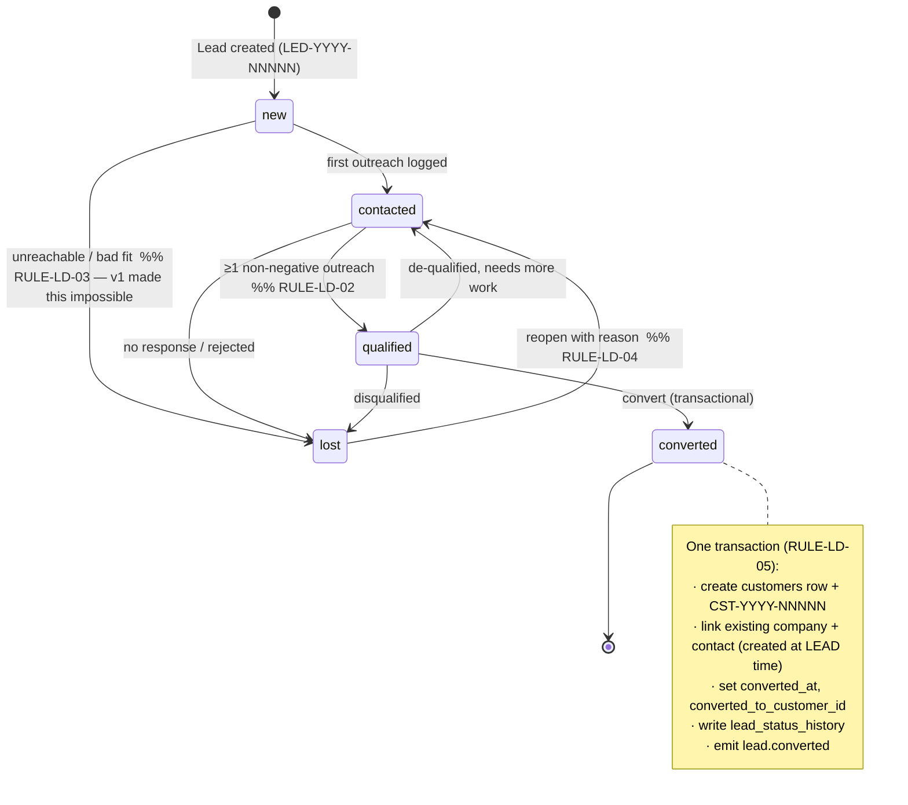
```mermaid
stateDiagram-v2
    [*] --> new : Lead created (LED-YYYY-NNNNN)

    new --> contacted : first outreach logged
    new --> lost : unreachable / bad fit  %% RULE-LD-03 — v1 made this impossible
    contacted --> qualified : ≥1 non-negative outreach  %% RULE-LD-02
    contacted --> lost : no response / rejected
    qualified --> converted : convert (transactional)
    qualified --> lost : disqualified
    qualified --> contacted : de-qualified, needs more work

    lost --> contacted : reopen with reason  %% RULE-LD-04
    converted --> [*]

    note right of converted
      One transaction (RULE-LD-05):
      · create customers row + CST-YYYY-NNNNN
      · link existing company + contact (created at LEAD time)
      · set converted_at, converted_to_customer_id
      · write lead_status_history
      · emit lead.converted
    end note
```

Every transition writes `lead_status_history` with actor and notes. `lost` requires `lostReason`; the funnel report is built on those reasons.

---

## 2a. Visit Plan State Machine

A scheduled field visit by a BDO or ASM to win or retain a client (CRM_MASTER §5.5a). Linked to a lead or a customer; feeds the Sales dashboard's upcoming-visits calendar and the follow-ups-due view.

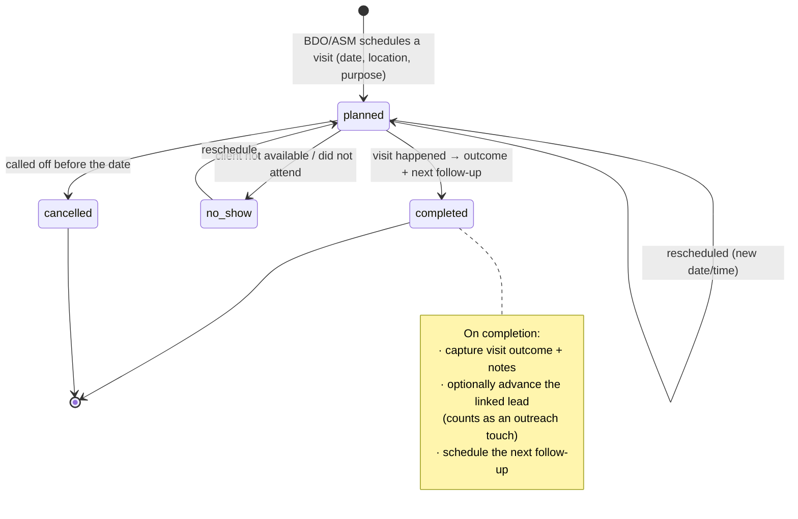
```mermaid
stateDiagram-v2
    [*] --> planned : BDO/ASM schedules a visit (date, location, purpose)

    planned --> completed : visit happened → outcome + next follow-up
    planned --> no_show : client not available / did not attend
    planned --> cancelled : called off before the date
    planned --> planned : rescheduled (new date/time)

    no_show --> planned : reschedule
    completed --> [*]
    cancelled --> [*]

    note right of completed
      On completion:
      · capture visit outcome + notes
      · optionally advance the linked lead
        (counts as an outreach touch)
      · schedule the next follow-up
    end note
```

A completed visit is also recorded as an outreach touch on the linked lead/customer timeline, so it can advance the lead machine (§2) exactly as a logged meeting does.

---

## 2b. Public Inquiry State Machine

The *direct* channel's intake (CRM_MASTER §5.20). An anonymous storefront visitor submits a rate-calculation + contact details; the row is a **demand signal**, not a customer, until a salesperson triages it.

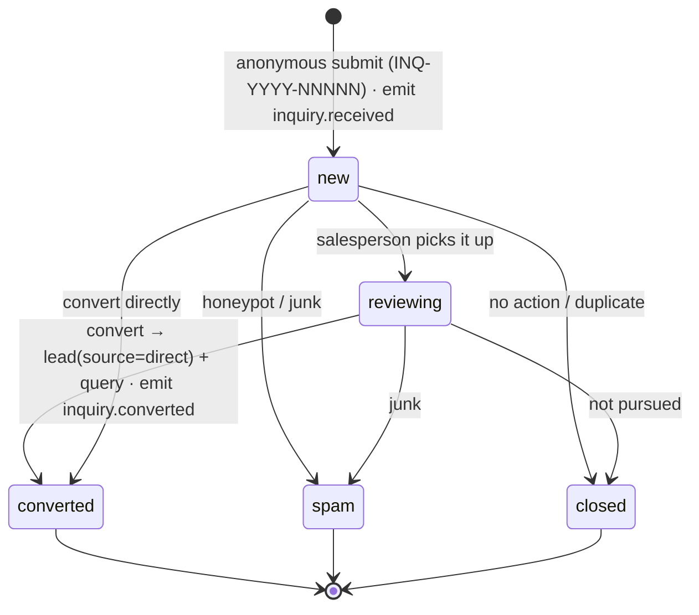
```mermaid
stateDiagram-v2
    [*] --> new : anonymous submit (INQ-YYYY-NNNNN) · emit inquiry.received

    new --> reviewing : salesperson picks it up
    reviewing --> converted : convert → lead(source=direct) + query · emit inquiry.converted
    new --> converted : convert directly
    new --> spam : honeypot / junk
    reviewing --> spam : junk
    new --> closed : no action / duplicate
    reviewing --> closed : not pursued

    converted --> [*]
    spam --> [*]
    closed --> [*]
```

Conversion is the only path that touches the pipeline: it creates a `direct` lead + a query in one transaction and links them back onto the inquiry (`convertedLeadId`, `convertedQueryId`). Nothing an anonymous visitor submits becomes a customer without a human triage step.

---

## 2c. Bank LC Referral State Machine

The *Bank LC* channel's intake (CRM_MASTER §5.21). A partner bank posts an LC over the authenticated webhook; the referral is idempotent on the bank's message/LC reference so replays never duplicate.

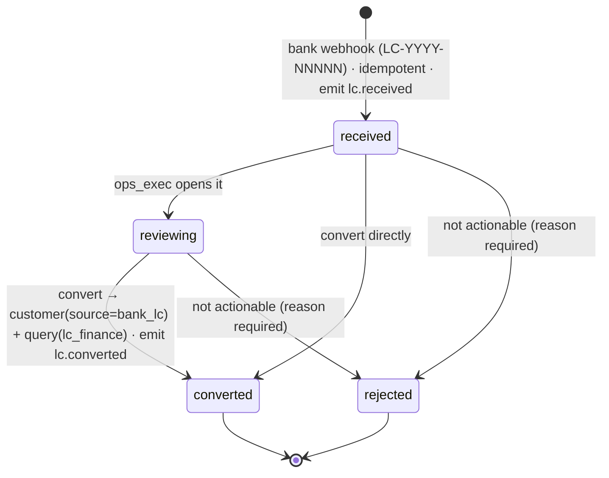
```mermaid
stateDiagram-v2
    [*] --> received : bank webhook (LC-YYYY-NNNNN) · idempotent · emit lc.received

    received --> reviewing : ops_exec opens it
    reviewing --> converted : convert → customer(source=bank_lc) + query(lc_finance) · emit lc.converted
    received --> converted : convert directly
    received --> rejected : not actionable (reason required)
    reviewing --> rejected : not actionable (reason required)

    converted --> [*]
    rejected --> [*]
```

The full raw webhook payload is retained on the referral for audit regardless of outcome. Conversion is a single transaction that materialises company + contact + customer + query and stamps the referral with the resulting IDs.

---

## 3. Query State Machine

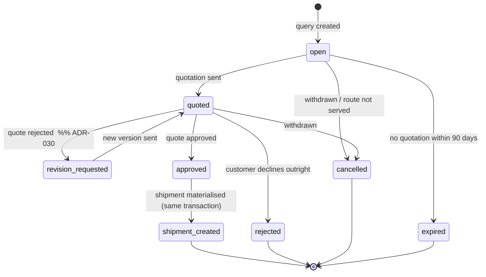
```mermaid
stateDiagram-v2
    [*] --> open : query created
    open --> quoted : quotation sent
    quoted --> revision_requested : quote rejected  %% ADR-030
    revision_requested --> quoted : new version sent
    quoted --> approved : quote approved
    approved --> shipment_created : shipment materialised (same transaction)
    quoted --> rejected : customer declines outright
    open --> cancelled : withdrawn / route not served
    quoted --> cancelled : withdrawn
    open --> expired : no quotation within 90 days

    shipment_created --> [*]
    rejected --> [*]
    cancelled --> [*]
    expired --> [*]
```

`rejected` (customer walks away) and `revision_requested` (re-quote me) are now distinct. In v1 both mapped to `open`, so `rejected` was unreachable and the pipeline could not distinguish "never quoted" from "quoted and pushed back".

---

## 4. Quotation State Machine

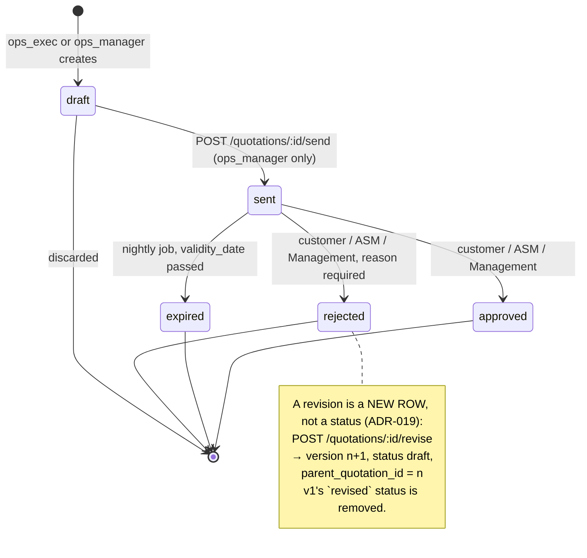
```mermaid
stateDiagram-v2
    [*] --> draft : ops_exec or ops_manager creates
    draft --> sent : POST /quotations/:id/send (ops_manager only)
    draft --> [*] : discarded

    sent --> approved : customer / ASM / Management
    sent --> rejected : customer / ASM / Management, reason required
    sent --> expired : nightly job, validity_date passed

    rejected --> [*]
    expired --> [*]
    approved --> [*]

    note right of rejected
      A revision is a NEW ROW, not a status (ADR-019):
      POST /quotations/:id/revise
        → version n+1, status draft,
          parent_quotation_id = n
      v1's `revised` status is removed.
    end note
```

**Invariants:** at most one `draft`/`sent` per query (INV-07); at most one `approved` per query (INV-08). Both are partial unique indexes, so a double-click cannot create two shipments.

---

## 4a. Service Package → OTD Template

The customer chooses **one of four service packages** (ADR-046, ADR-049). The package presets the query's `services ServiceCode[]` set, and on quote approval the shipment is seeded with the **subset of the canonical step catalog the package, CRO mode and service set select** — always in canonical order. This is the mechanism behind "a local order has fewer steps and no customs role."

| Package | Route shape | Presets `services` | CRO sub-option |
|---|---|---|---|
| `local_transport` — Local Transport | address → address | `local_transport` | none (`not_applicable`) |
| `loading_point_to_port` — Loading Point → Port | address → port | `local_transport`, `port_handling` | **`customer` or `consort`** |
| `international` — International Shipment | port → port | `local_transport`, `port_handling`, `customs_clearance`, `sea_freight` | `consort` |
| `port_to_consignee` — Port → Consignee (import delivery) | port → address | `local_transport`, `port_handling` | none (`not_applicable`) |

`lc_finance` and `destination_services` are add-ons layered on any package: `lc_finance` is implied when the customer's `source` is Bank LC (§1) and may also be added explicitly; `destination_services` is an Ops per-job addition to an **export** package.

**Why `port_to_consignee` does not simply reuse the destination-agent steps.** The physical work matches (`destination_do` / `destination_pickup` / `empty_return`), but those are the far end of somebody else's export job — performed by an overseas agent and Operations-owned — whereas this leg runs on our own vehicles and is Transport-owned end to end. The customer also supplies the delivery order and gate pass themselves, so those belong in the `order_confirmed` pack rather than in a step that goes and obtains them. See ADR-049.

`port_to_consignee` is the first package to need **a port code and a street address at the same time**: `origin_port` is the terminal holding the container, `delivery_address` is the consignee. It also carries two terms no other package has — `free_days` (the detention-free window the line granted) and `empty_return_location` (where the empty goes back, often a dry port rather than the terminal it came off).

### 4a.1 Step → package/CRO/service composition

Three gates are evaluated **package → CRO mode → service**, each *empty means don't gate*. `always: true` combined with a non-empty package list reads "always, on these packages". Canonical numbers are spaced by 10 so steps can be inserted without renumbering; the composition logic renumbers to 1..N for display and retains `step_code` and the canonical number for reporting.

| # | Step (code) | Owner | Packages | CRO | Service | Required docs |
|---|---|---|---|---|---|---|
| 10 | `order_lock` | Operations | **ALWAYS** | — | — | — |
| 20 | `order_confirmed` (customer doc pack) | Operations | lp→port, intl, port→cons | — | — | *(sub-actions — §4a.2)* |
| 22 | `transporter_assigned` | Transport | local | — | — | — |
| 24 | `vehicle_dispatched` | Transport | local | — | — | — |
| 26 | `goods_loaded` | Transport | local | — | — | proof |
| 28 | `in_transit` | Transport | local | — | — | — |
| 30 | `lc_generated` (SWIFT/LC advice) | Compliance | — | — | `lc_finance` | lc |
| 40 | `vessel_booked` | Operations | — | — | `sea_freight` | — |
| 50 | `cro_received_from_customer` | Operations | lp→port, intl | **customer** | — | **cro** |
| 55 | `cro_released` (apply & obtain from line) | Operations | lp→port, intl | **consort** | — | commercial_invoice, packing_list, authority_letterhead, cro |
| 60 | `empty_container_pickup` (LOLO) | Transport | lp→port, intl | — | `local_transport` | eir_out |
| 70 | `cargo_pickup` (stuffing) | Transport | lp→port, intl | — | `local_transport` | — |
| 80 | `inland_transit` | Transport | lp→port, intl | — | `local_transport` | — |
| 95 | `customs_clearance` | Compliance | — | — | `customs_clearance` | *(sub-actions — §4a.2)* |
| ~~90~~ | ~~`customs_entry`~~ | *superseded by 95 (ADR-048) — row kept `active: false` so historical shipments still resolve* ||||
| ~~100~~ | ~~`inspected_sealed`~~ | *superseded by 95 (ADR-048)* ||||
| 110 | `port_handover` (gate-in) | Operations | lp→port, intl | — | `port_handling` ∨ `sea_freight` | eir_in |
| 120 | `bol_issued` | Operations | — | — | `sea_freight` | bol |
| 130 | `bol_submitted` (docs to bank) | Finance | — | — | `lc_finance` | bank_receipt |
| 140 | `telex_released` | Finance | — | — | `sea_freight` | telex |
| 150 | `destination_do` | Operations | lp→port, intl | — | `destination_services` | delivery_order, gate_pass |
| 152 | `import_container_pickup` (off the terminal) | **Transport** | port→cons | — | — | eir_pickup |
| 160 | `destination_pickup` | Operations | lp→port, intl | — | `destination_services` | eir_pickup |
| 170 | `delivered` (final delivery / POD) | Operations | intl | — | — | pod |
| 172 | `local_delivered` (delivered & POD) | **Transport** | local, port→cons | — | — | pod |
| 175 | `port_job_completed` (handover confirmed) | Operations | lp→port | — | — | — |
| 178 | `import_empty_return` | **Transport** | port→cons | — | — | eir_empty_return |
| 180 | `empty_return` | Operations | lp→port, intl | — | `destination_services` | eir_empty_return |

Rules:

1. Seed every step passing all three gates, ordered by canonical number. Renumber for display as 1..N of the composed path.
2. **A department with no step on the composed path has no role on that shipment** — no queue entry, no task, no ownership. A local-only shipment therefore never involves Compliance/Customs.
3. `shipments.status` is derived from the highest completed step **on the composed path** (§5.1). A shorter path exposes only its own subset of the status enum.
4. Every package composes **exactly one step deriving `delivered`** from its delivery milestone — 170, 172 or 175. This is load-bearing: `maybeSettleTx` only settles a shipment whose status is `delivered`, so a package without one could never settle or close. An empty-return step (178/180) runs *after* it and also derives `delivered`, which changes nothing: settlement additionally refuses while any step is still pending.
5. The two CRO rows (50 and 55) are **mutually exclusive** and are separate template rows rather than one conditional row, because `OtdStep` persists neither `title` nor `requiredDocTypes` — both are looked up from the template by `step_code` at completion time.
6. The composed template, the package and the CRO mode are all **frozen at approval** and stored on the shipment (INV-14). Changing them afterwards is a controlled, audited re-scope (out of Phase-1 scope unless raised as an exception).
7. The one permitted out-of-order pair (RULE-SH-03) is `lc_generated` ↔ `vessel_booked`, keyed on **step code**, not canonical number — so re-spacing the catalog can never silently relocate the exemption.
8. A superseded step is **deactivated, not deleted** (`active: false`). Composition skips it, but `missingRequiredDocs` and `recomputeStatus` still resolve it by `step_code` for shipments that already ran it.

### 4a.2 Sub-actions — one main step, a checklist beneath it

Two steps are single milestones made of several parts. Rather than split them into steps that have no order between them, own no distinct status and would fire fake status transitions, they carry an ordered **sub-action checklist** (ADR-048), seeded in `otd_step_action_templates` and materialised per shipment at approval. Sub-actions use the **same three gates as steps**, which is how one `order_confirmed` step carries two different document packs.

**`order_confirmed` — international** (7 items, all documents):

```
□ Packing List                packing_list
□ GD / Customs Declaration    gd
■ Quotation (auto-attached)   quotation           ← rendered from the approved quote at approval
□ Undertaking                 undertaking
□ Sales Tax Invoice           sales_tax_invoice
□ Commercial Invoice          commercial_invoice
□ Certificate of Origin       certificate_of_origin
```

**`order_confirmed` — loading point → port** (3 items): `packing_list`, `commercial_invoice`, `authority_letterhead`. Local Transport composes no checklist at all — it has no `order_confirmed` step.

**`order_confirmed` — port → consignee** (4 items — 3 documents, 1 manual):

```
□ Bill of Lading (BOL)                    document · bol
□ Delivery Order (DO)                     document · delivery_order
□ Gate Pass                               document · gate_pass
□ Free days confirmed with customer       manual
```

This is everything the customer owes us before we can take their container off the terminal: the BOL proves title, the delivery order is the line's release, the gate pass is what the terminal wants at the gate, and the free days set the clock we are racing before detention starts. The number itself is captured at intake on `queries.free_days` and snapshotted to the shipment — the checklist item is the confirmation that it was actually agreed.

**`customs_clearance`** (6 items — 4 manual, 2 documents):

```
□ GD filed in WeBOC / PSW           manual
□ Duty & taxes paid                 manual
□ GD document attached              document · gd
□ Examination scheduled             manual
□ Cargo examined & seal applied     manual
□ Inspection certificate attached   document · inspection_cert
```

Rules:

1. A **`document`** item is satisfied by a live document of its `doc_type` on the shipment — **derived at read time, never stored**, so it cannot disagree with the files on record. It may not be ticked by hand (409). Its doc type is unioned into RULE-SH-06, so a document blocks a step in exactly one place.
2. A **`manual`** item is ticked by a member of the step's owning department (RULE-SH-04) and gates completion under RULE-SH-13. `shipment.force_override` does **not** bypass it — an override answers a sequence question, and an open checklist item is unfinished work.
3. Both gates are evaluated together and reported in **one** 422, because a step can fail both.
4. Reopening a step resets its `manual` items; `document` items stay satisfied.
5. The **Quotation** item is never asked of the customer: we already hold the approved quote, so it is rendered to PDF (sell side only) and attached at approval. Generation is best-effort — a failure must not roll back an approval, and a manual upload of the same doc type satisfies the item.
6. A document satisfies **every** item naming its type across the shipment. The `gd` collected at order confirmation therefore also satisfies the customs checklist's GD item — deliberate, since it is the same document.

### 4a.3 Example — Local Transport (6 steps, no container, no port, no trade docs)

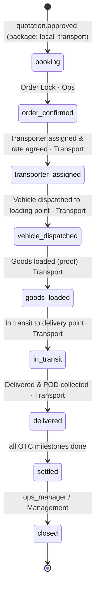
```mermaid
stateDiagram-v2
    [*] --> booking : quotation.approved (package: local_transport)
    booking --> order_confirmed : Order Lock · Ops
    order_confirmed --> transporter_assigned : Transporter assigned & rate agreed · Transport
    transporter_assigned --> vehicle_dispatched : Vehicle dispatched to loading point · Transport
    vehicle_dispatched --> goods_loaded : Goods loaded (proof) · Transport
    goods_loaded --> in_transit : In transit to delivery point · Transport
    in_transit --> delivered : Delivered & POD collected · Transport
    delivered --> settled : all OTC milestones done
    settled --> closed : ops_manager / Management
    closed --> [*]
```

### 4a.4 Example — Loading Point → Port (8 steps; only step 3 differs by CRO mode)

```
1  order_lock                              Ops        —
2  order_confirmed                         Ops        3-item checklist: packing_list, commercial_invoice, authority_letterhead
3  cro_received_from_customer  (customer)  Ops        cro                ← customer uploads from the portal
   cro_released                (consort)   Ops        commercial_invoice, packing_list, authority_letterhead, cro
4  empty_container_pickup                  Transport  eir_out
5  cargo_pickup                            Transport  —
6  inland_transit                          Transport  —
7  port_handover                           Ops        eir_in
8  port_job_completed                      Ops        —                  → derives `delivered`
```

### 4a.5 Example — International (12 steps, + add-ons)

Package `international` with `croHandledBy: consort` composes 10, 20, 40, 55, 60, 70, 80, **95**, 110, 120, 140, 170. Adding `lc_finance` inserts `lc_generated` (30) and `bol_submitted` (130) → 14 steps; adding `destination_services` inserts `destination_do` (150), `destination_pickup` (160) and `empty_return` (180) → 15.

Two of those twelve carry checklists (§4a.2): step 2 collects the seven-document customer pack, and step 8 (`customs_clearance`) carries the six filing/examination items that were previously two separate steps.

### 4a.6 Example — Port → Consignee (5 steps; the import delivery leg)

```
1  order_lock                  Ops        rate_confirmation
2  order_confirmed             Ops        4-item checklist: bol, delivery_order, gate_pass, free days confirmed
3  import_container_pickup     Transport  eir_pickup           ← collected off the terminal
4  local_delivered             Transport  pod                  → derives `delivered`
5  import_empty_return         Transport  eir_empty_return     ← the empty goes back; the job is done
```

The operational job ends at step 5, but the shipment does **not** close there: settlement still requires all five OTD steps done, all five OTC milestones complete and every live invoice paid (§5.3), after which `ops_manager` / Management closes it (RULE-SH-12).

---

## 5. Shipment Machines

### 5.1 OTD progression — the full superset (17 steps)

This is the path for a shipment that bought **everything**: the `international` package plus both add-ons (`lc_finance`, `destination_services`). A shipment with fewer services runs a **subset of this exact machine**, in the same order, per §4a. The always-on endpoints are `order_lock`/`order_confirmed` at the front and a `delivered`-deriving terminal at the back.

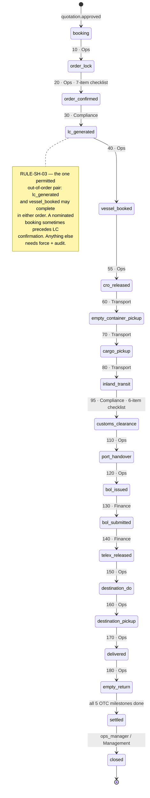
```mermaid
stateDiagram-v2
    [*] --> booking : quotation.approved

    booking --> order_lock : 10 · Ops
    order_lock --> order_confirmed : 20 · Ops · 7-item checklist
    order_confirmed --> lc_generated : 30 · Compliance
    lc_generated --> vessel_booked : 40 · Ops
    vessel_booked --> cro_released : 55 · Ops
    cro_released --> empty_container_pickup : 60 · Transport
    empty_container_pickup --> cargo_pickup : 70 · Transport
    cargo_pickup --> inland_transit : 80 · Transport
    inland_transit --> customs_clearance : 95 · Compliance · 6-item checklist
    customs_clearance --> port_handover : 110 · Ops
    port_handover --> bol_issued : 120 · Ops
    bol_issued --> bol_submitted : 130 · Finance
    bol_submitted --> telex_released : 140 · Finance
    telex_released --> destination_do : 150 · Ops
    destination_do --> destination_pickup : 160 · Ops
    destination_pickup --> delivered : 170 · Ops
    delivered --> empty_return : 180 · Ops

    empty_return --> settled : all 5 OTC milestones done
    settled --> closed : ops_manager / Management
    closed --> [*]

    note right of lc_generated
      RULE-SH-03 — the one permitted
      out-of-order pair: lc_generated
      and vessel_booked may complete
      in either order. A nominated
      booking sometimes precedes LC
      confirmation. Anything else
      needs force + audit.
    end note
```

**`shipments.status` is derived** — the status of the highest completed step (ADR-003). No endpoint writes it. Reopening step *n* reopens all steps after *n* and recomputes downward (RULE-SH-05). Note that both `delivered` (170) and `empty_return` (180) derive the `delivered` status, which is why the empty-container return does not push the shipment past it.

The trucking and container-handling steps (60, 70, 80, and the whole 22–28 local leg) are owned by Transport (ADR-039); Compliance owns 30 and 95; Finance owns 130 and 140; Ops retains the rest.

### 5.2 Exception lifecycle — orthogonal to progress

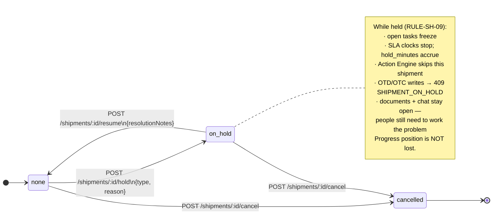
```mermaid
stateDiagram-v2
    direction LR
    [*] --> none
    none --> on_hold : POST /shipments/:id/hold\n{type, reason}
    on_hold --> none : POST /shipments/:id/resume\n{resolutionNotes}
    none --> cancelled : POST /shipments/:id/cancel
    on_hold --> cancelled : POST /shipments/:id/cancel
    cancelled --> [*]

    note right of on_hold
      While held (RULE-SH-09):
      · open tasks freeze
      · SLA clocks stop; hold_minutes accrue
      · Action Engine skips this shipment
      · OTD/OTC writes → 409 SHIPMENT_ON_HOLD
      · documents + chat stay open —
        people still need to work the problem
      Progress position is NOT lost.
    end note
```

A shipment is `on_hold at step 7`, not "in an on_hold status". This is why the two concepts are separate columns.

### 5.3 OTC milestones

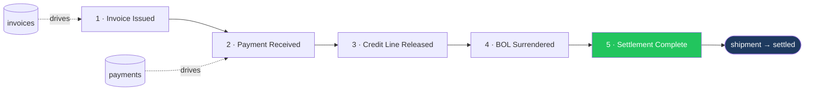
```mermaid
flowchart LR
    M1[1 · Invoice Issued] --> M2[2 · Payment Received]
    M2 --> M3[3 · Credit Line Released]
    M3 --> M4[4 · BOL Surrendered]
    M4 --> M5[5 · Settlement Complete]
    M5 --> DONE([shipment → settled])

    I1[(invoices)] -.drives.-> M1
    P1[(payments)] -.drives.-> M2

    style M5 fill:#22C55E,color:#fff
    style DONE fill:#1E3A5F,color:#fff
```

Milestones 1 and 2 are **completed automatically** by the finance module when an invoice is issued and fully paid (RULE-FI-02/03). Milestones 3–5 are recorded by Accounts. The `amount` on a milestone is a display mirror; reports always aggregate `invoices` and `payments` (ADR-006).

---

## 6. Domain Event Catalog

Triggers are **events, not statuses** (ADR-020). This catalog is closed: an event exists only if it is defined in `packages/contracts` **and** listed in this section — update both together when adding one.

| Event | Emitted when | Consumers |
|---|---|---|
| `customer.registered` | Visitor self-registers on the storefront (§5.16a) | notifications (Sales — assign a BDO; flags name clashes) |
| `inquiry.received` | Anonymous storefront request submitted | notifications (Sales/ASM triage inbox) |
| `inquiry.converted` | Public Inquiry triaged into a lead + query | audit |
| `lc.received` | Bank posts an LC to the intake webhook | notifications (Operations, `ops_exec` inbox) |
| `lc.converted` | Bank LC Referral converted into a customer + query | audit, notifications (BDO/ASM) |
| `lead.created` | Lead created | audit |
| `lead.converted` | Conversion transaction commits | notifications (ASM), reports |
| `lead.stale` | 14 days without outreach | notifications (BDO → ASM at 30d) |
| `visit.scheduled` | Visit Plan created | notifications (assigned BDO/ASM), calendar |
| `visit.completed` | Visit marked completed | lead outreach touch, follow-up scheduling |
| `visit.no_show` | Visit marked no-show | notifications (BDO → ASM), reschedule prompt |
| `query.created` | Query created | notifications (Ops) |
| `query.hazardous` | Hazardous or reefer query | Action Engine → Compliance pre-check |
| `query.stale` | 14 days without a quotation | notifications (BDO, ASM) |
| `quotation.sent` | Ops Manager sends | notifications (customer, BDO), email |
| `quotation.approved` | Approval transaction commits | **Action Engine**, notifications, invoice drafting |
| `quotation.rejected` | Rejection | notifications (Ops) |
| `quotation.expiring` | 48 h before `validityDate` | notifications (Ops, BDO) |
| `quotation.expired` | Nightly sweep | notifications, query → `revision_requested` |
| `shipment.created` | Shipment materialised | chat channel creation, notifications |
| `shipment.step.completed:<code>` | An OTD step completes (only steps on the composed path exist to complete) | **Action Engine**, socket, notifications |
| `shipment.step.reopened:<code>` | A step is reopened | audit, notifications |
| `shipment.held` | Hold raised | Action Engine (freeze), notifications |
| `shipment.resumed` | Hold cleared | Action Engine (thaw), notifications |
| `shipment.cancelled` | Cancellation | task cancellation, invoice voiding, notifications |
| `shipment.closed` | Closure | reports |
| `shipment.eta_breached` | ETA passes undelivered | auto-exception, notifications |
| `invoice.issued` | Invoice issued | OTC milestone 1, notifications, email |
| `invoice.overdue` | 7 days past due | Action Engine → chase task; 30 d escalates |
| `payment.received` | Payment recorded | OTC milestone 2, notifications |
| `task.assigned` | Task created or reassigned | notifications, socket |
| `task.overdue` | Hourly sweep | notifications (assignee → head → Management at 48 h) |
| `task.unassigned` | Routed to a department queue | notifications (department head) |
| `action.unroutable` | No template match, or no eligible assignee | **Management alert** — never silently dropped |
| `user.deactivated` | Account deactivated | socket force-disconnect, session revocation |

Every event flows through `outbox_events` (ADR-021) and is consumed idempotently (RULE-AE-04).

---

## 7. Real-Time Contract

### 7.1 Connection and room assignment

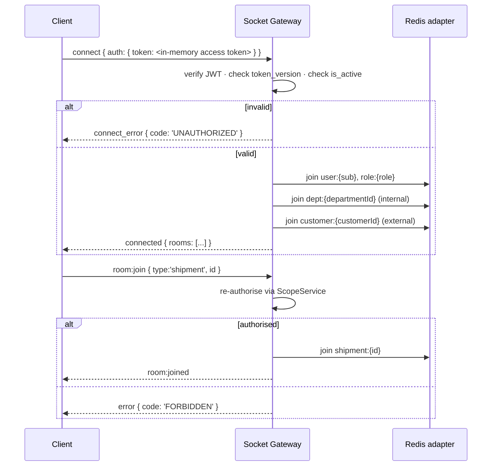
```mermaid
sequenceDiagram
    participant C as Client
    participant GW as Socket Gateway
    participant R as Redis adapter

    C->>GW: connect { auth: { token: <in-memory access token> } }
    GW->>GW: verify JWT · check token_version · check is_active
    alt invalid
        GW-->>C: connect_error { code: 'UNAUTHORIZED' }
    else valid
        GW->>R: join user:{sub}, role:{role}
        GW->>R: join dept:{departmentId}    (internal)
        GW->>R: join customer:{customerId}  (external)
        GW-->>C: connected { rooms: [...] }
    end

    C->>GW: room:join { type:'shipment', id }
    GW->>GW: re-authorise via ScopeService
    alt authorised
        GW->>R: join shipment:{id}
        GW-->>C: room:joined
    else
        GW-->>C: error { code: 'FORBIDDEN' }
    end
```

**Rooms are assigned server-side from the verified token.** Clients never request a user, role or department room. v1's client-emitted `joinUser` had no handler, so the `user:{id}` room was never joined and no notification was ever delivered.

### 7.2 Event catalog

Server → client:

| Event | Payload | Rooms |
|---|---|---|
| `notification:new` | `NotificationDto` | `user:{id}` |
| `shipment:updated` | `{ shipmentId, status, exceptionState, updatedAt, actorId }` | `shipment:{id}`, `customer:{id}` |
| `shipment:stepCompleted` | `{ shipmentId, stepNumber, stepCode, completedAt, completedBy }` | `shipment:{id}` |
| `task:assigned` | `TaskDto` | `user:{id}`, `dept:{id}` |
| `task:updated` | `{ taskId, status, updatedAt }` | `user:{id}`, `shipment:{id}` |
| `chat:message` | `ChatMessageDto` | `channel:{id}` |
| `chat:read` | `{ channelId, userId, lastReadMessageId }` | `channel:{id}` |
| `chat:typing` | `{ channelId, userId }` | `channel:{id}` |
| `presence:changed` | `{ userId, online }` | `dept:{id}` |

Client → server: `room:join`, `room:leave`, `chat:send`, `chat:markRead`, `chat:typing`.

### 7.3 Delivery guarantees

1. **Events are invalidation hints, never authoritative state.** A client receiving `shipment:updated` invalidates the query key and re-fetches. It does not render the payload as truth. This makes read-replica lag and out-of-order delivery harmless (EDGE-T-05).
2. **REST is complete without sockets.** A client that never connects loses live push and nothing else.
3. Reconnect uses exponential backoff with jitter; on reconnect the client re-joins its resource rooms and invalidates all cached query keys.
4. Redis adapter for horizontal scale; the gateway is stateless.

---

## 8. Sequence — Login

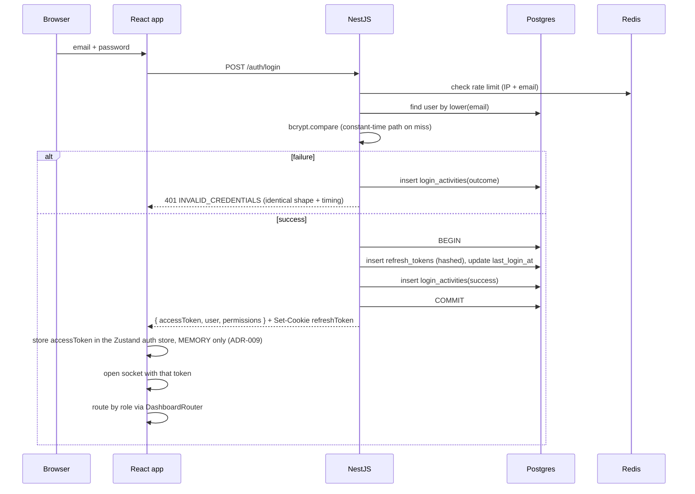
```mermaid
sequenceDiagram
    participant U as Browser
    participant FE as React app
    participant API as NestJS
    participant DB as Postgres
    participant RD as Redis

    U->>FE: email + password
    FE->>API: POST /auth/login
    API->>RD: check rate limit (IP + email)
    API->>DB: find user by lower(email)
    API->>API: bcrypt.compare (constant-time path on miss)
    alt failure
        API->>DB: insert login_activities(outcome)
        API-->>FE: 401 INVALID_CREDENTIALS  (identical shape + timing)
    else success
        API->>DB: BEGIN
        API->>DB: insert refresh_tokens (hashed), update last_login_at
        API->>DB: insert login_activities(success)
        API->>DB: COMMIT
        API-->>FE: { accessToken, user, permissions } + Set-Cookie refreshToken
        FE->>FE: store accessToken in the Zustand auth store, MEMORY only (ADR-009)
        FE->>FE: open socket with that token
        FE->>FE: route by role via DashboardRouter
    end
```

---

## 8a. Sequence — Public Inquiry Intake (the *direct* channel)

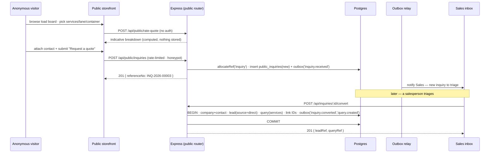
```mermaid
sequenceDiagram
    participant V as Anonymous visitor
    participant FE as Public storefront
    participant API as Express (public router)
    participant DB as Postgres
    participant RLY as Outbox relay
    participant BDO as Sales inbox

    V->>FE: browse load board · pick services/lane/container
    FE->>API: POST /api/public/rate-quote   (no auth)
    API-->>FE: indicative breakdown (computed, nothing stored)
    V->>FE: attach contact + submit "Request a quote"
    FE->>API: POST /api/public/inquiries   (rate-limited · honeypot)
    API->>DB: allocateRef('inquiry') · insert public_inquiries(new) + outbox('inquiry.received')
    API-->>FE: 201 { referenceNo: INQ-2026-00003 }
    RLY->>BDO: notify Sales — new inquiry to triage

    Note over BDO,DB: later — a salesperson triages
    BDO->>API: POST /api/inquiries/:id/convert
    API->>DB: BEGIN · company+contact · lead(source=direct) · query(services) · link IDs · outbox('inquiry.converted','query.created')
    API->>DB: COMMIT
    API-->>BDO: 201 { leadRef, queryRef }
```

Indicative pricing is non-binding and never persisted; only a deliberate "Request a quote" creates a row, and even then a human converts it before it enters the pipeline.

---

## 8b. Sequence — Bank LC Intake (the *bank_lc* channel)

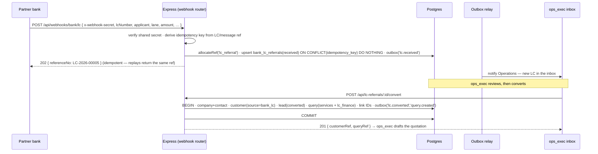
```mermaid
sequenceDiagram
    participant BK as Partner bank
    participant API as Express (webhook router)
    participant DB as Postgres
    participant RLY as Outbox relay
    participant OPS as ops_exec inbox

    BK->>API: POST /api/webhooks/bank/lc  { x-webhook-secret, lcNumber, applicant, lane, amount, … }
    API->>API: verify shared secret · derive idempotency key from LC/message ref
    API->>DB: allocateRef('lc_referral') · upsert bank_lc_referrals(received) ON CONFLICT(idempotency_key) DO NOTHING · outbox('lc.received')
    API-->>BK: 202 { referenceNo: LC-2026-00005 }   (idempotent — replays return the same ref)
    RLY->>OPS: notify Operations — new LC in the inbox

    Note over OPS,DB: ops_exec reviews, then converts
    OPS->>API: POST /api/lc-referrals/:id/convert
    API->>DB: BEGIN · company+contact · customer(source=bank_lc) · lead(converted) · query(services + lc_finance) · link IDs · outbox('lc.converted','query.created')
    API->>DB: COMMIT
    API-->>OPS: 201 { customerRef, queryRef } → ops_exec drafts the quotation
```

The webhook authenticates by shared secret and is idempotent on the bank's own reference, so a bank that retries never creates a duplicate referral. The raw payload is stored verbatim for audit.

---

## 9. Sequence — Quote Approval (the system's pivot)

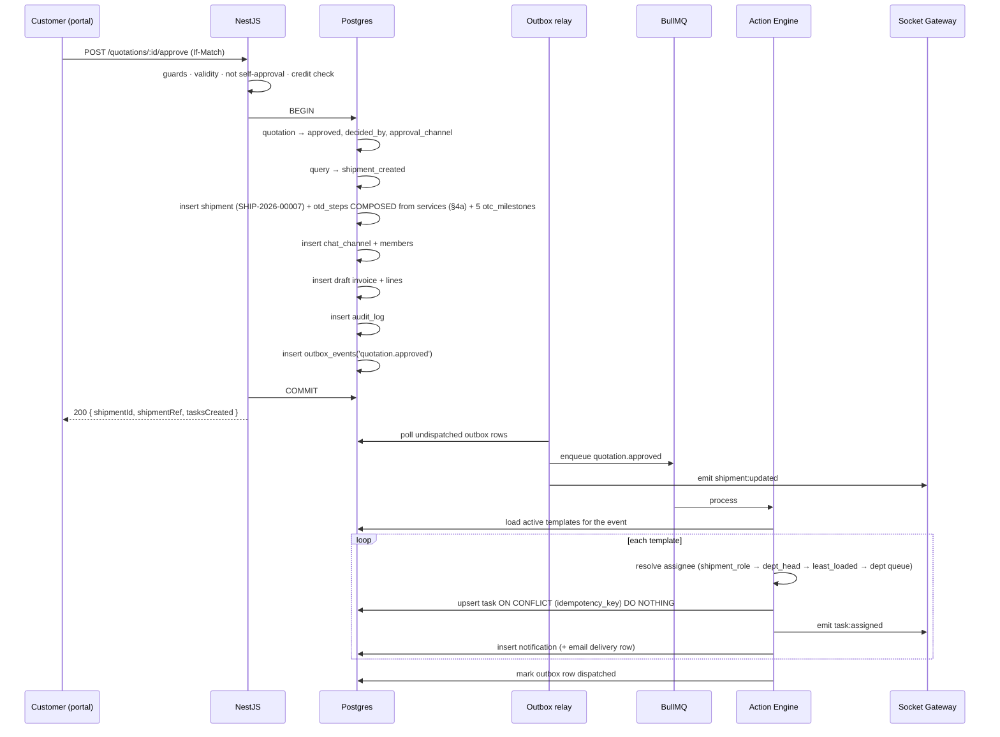
```mermaid
sequenceDiagram
    participant CU as Customer (portal)
    participant API as NestJS
    participant DB as Postgres
    participant RLY as Outbox relay
    participant Q as BullMQ
    participant AE as Action Engine
    participant WS as Socket Gateway

    CU->>API: POST /quotations/:id/approve (If-Match)
    API->>API: guards · validity · not self-approval · credit check
    API->>DB: BEGIN
    DB->>DB: quotation → approved, decided_by, approval_channel
    DB->>DB: query → shipment_created
    DB->>DB: insert shipment (SHIP-2026-00007) + otd_steps COMPOSED from services (§4a) + 5 otc_milestones
    DB->>DB: insert chat_channel + members
    DB->>DB: insert draft invoice + lines
    DB->>DB: insert audit_log
    DB->>DB: insert outbox_events('quotation.approved')
    API->>DB: COMMIT
    API-->>CU: 200 { shipmentId, shipmentRef, tasksCreated }

    RLY->>DB: poll undispatched outbox rows
    RLY->>Q: enqueue quotation.approved
    RLY->>WS: emit shipment:updated
    Q->>AE: process
    AE->>DB: load active templates for the event
    loop each template
        AE->>AE: resolve assignee (shipment_role → dept_head → least_loaded → dept queue)
        AE->>DB: upsert task ON CONFLICT (idempotency_key) DO NOTHING
        AE->>WS: emit task:assigned
        AE->>DB: insert notification (+ email delivery row)
    end
    AE->>DB: mark outbox row dispatched
```

**Everything in the transaction commits or nothing does** (RULE-QT-07). The queue enqueue and socket emit are outside it, bridged by the outbox — which is why a Redis outage cannot lose a task (EDGE-V-01).

---

## 10. Sequence — OTD Step Completion

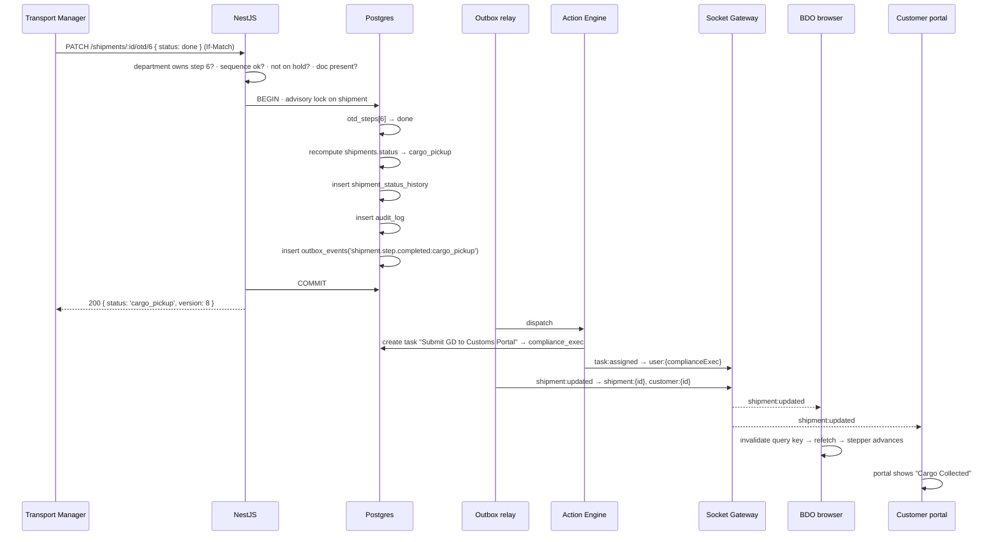
```mermaid
sequenceDiagram
    participant TRN as Transport Manager
    participant API as NestJS
    participant DB as Postgres
    participant RLY as Outbox relay
    participant AE as Action Engine
    participant WS as Socket Gateway
    participant BDO as BDO browser
    participant CUS as Customer portal

    TRN->>API: PATCH /shipments/:id/otd/6 { status: done } (If-Match)
    API->>API: department owns step 6? · sequence ok? · not on hold? · doc present?
    API->>DB: BEGIN · advisory lock on shipment
    DB->>DB: otd_steps[6] → done
    DB->>DB: recompute shipments.status → cargo_pickup
    DB->>DB: insert shipment_status_history
    DB->>DB: insert audit_log
    DB->>DB: insert outbox_events('shipment.step.completed:cargo_pickup')
    API->>DB: COMMIT
    API-->>TRN: 200 { status: 'cargo_pickup', version: 8 }

    RLY->>AE: dispatch
    AE->>DB: create task "Submit GD to Customs Portal" → compliance_exec
    AE->>WS: task:assigned → user:{complianceExec}
    RLY->>WS: shipment:updated → shipment:{id}, customer:{id}
    WS-->>BDO: shipment:updated
    WS-->>CUS: shipment:updated
    BDO->>BDO: invalidate query key → refetch → stepper advances
    CUS->>CUS: portal shows "Cargo Collected"
```

Compare with v1: the service emitted `statusUpdated` while the client listened for `shipmentUpdate`, so this sequence terminated silently at the gateway.

---

## 11. Sequence — Shipment Hold and Resume

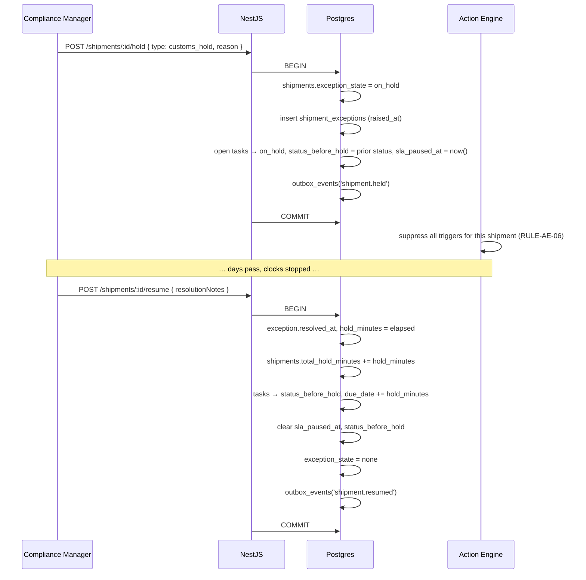
```mermaid
sequenceDiagram
    participant CMP as Compliance Manager
    participant API as NestJS
    participant DB as Postgres
    participant AE as Action Engine

    CMP->>API: POST /shipments/:id/hold { type: customs_hold, reason }
    API->>DB: BEGIN
    DB->>DB: shipments.exception_state = on_hold
    DB->>DB: insert shipment_exceptions (raised_at)
    DB->>DB: open tasks → on_hold, status_before_hold = prior status, sla_paused_at = now()
    DB->>DB: outbox_events('shipment.held')
    API->>DB: COMMIT
    AE->>AE: suppress all triggers for this shipment (RULE-AE-06)

    Note over CMP,AE: … days pass, clocks stopped …

    CMP->>API: POST /shipments/:id/resume { resolutionNotes }
    API->>DB: BEGIN
    DB->>DB: exception.resolved_at, hold_minutes = elapsed
    DB->>DB: shipments.total_hold_minutes += hold_minutes
    DB->>DB: tasks → status_before_hold, due_date += hold_minutes
    DB->>DB: clear sla_paused_at, status_before_hold
    DB->>DB: exception_state = none
    DB->>DB: outbox_events('shipment.resumed')
    API->>DB: COMMIT
```

Shifting due dates by the hold duration is what keeps the overdue-task metric honest. Without it every held shipment poisons the department's SLA numbers (RULE-SH-10). The task columns `sla_paused_at` and `status_before_hold` are defined in ADR-038; both are cleared on resume, so a task is "held" iff `sla_paused_at` is set.

---

## 12. Sequence — Employee Offboarding

The edge case most often missed, and the one that corrupts ownership data when it is.

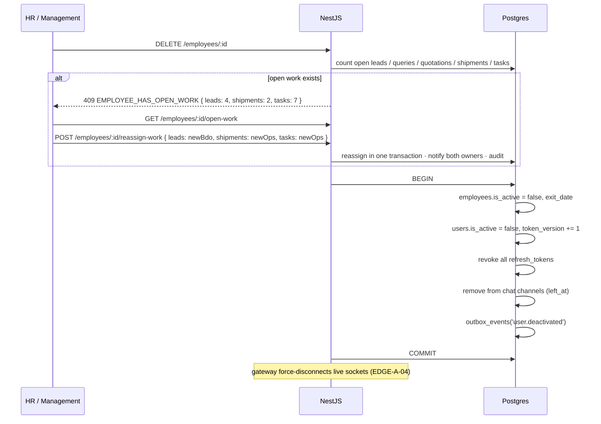
```mermaid
sequenceDiagram
    participant HR as HR / Management
    participant API as NestJS
    participant DB as Postgres

    HR->>API: DELETE /employees/:id
    API->>DB: count open leads / queries / quotations / shipments / tasks
    alt open work exists
        API-->>HR: 409 EMPLOYEE_HAS_OPEN_WORK { leads: 4, shipments: 2, tasks: 7 }
        HR->>API: GET /employees/:id/open-work
        HR->>API: POST /employees/:id/reassign-work { leads: newBdo, shipments: newOps, tasks: newOps }
        API->>DB: reassign in one transaction · notify both owners · audit
    end
    API->>DB: BEGIN
    DB->>DB: employees.is_active = false, exit_date
    DB->>DB: users.is_active = false, token_version += 1
    DB->>DB: revoke all refresh_tokens
    DB->>DB: remove from chat channels (left_at)
    DB->>DB: outbox_events('user.deactivated')
    API->>DB: COMMIT
    Note over API: gateway force-disconnects live sockets (EDGE-A-04)
```

---

## 13. Department Responsibility Map

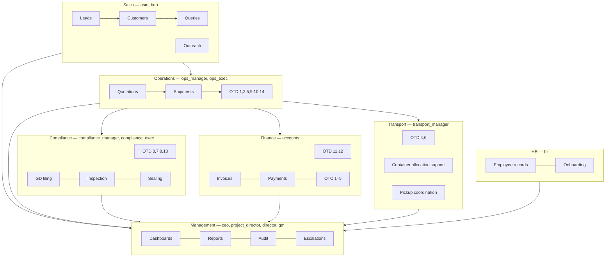
```mermaid
flowchart TB
    subgraph SALES ["Sales — asm, bdo"]
        L[Leads] --> C[Customers] --> Q[Queries]
        O[Outreach]
    end
    subgraph OPS ["Operations — ops_manager, ops_exec"]
        QT[Quotations] --> SH[Shipments]
        SH --> S1["OTD 1,2,5,9,10,14"]
    end
    subgraph COMP ["Compliance — compliance_manager, compliance_exec"]
        S2["OTD 3,7,8,13"]
        GD[GD filing] --- INS[Inspection] --- SEAL[Sealing]
    end
    subgraph FIN ["Finance — accounts"]
        S3["OTD 11,12"]
        INV[Invoices] --- PAY[Payments] --- OTC[OTC 1–5]
    end
    subgraph TRANS ["Transport — transport_manager"]
        S4["OTD 4,6"]
        CNT[Container allocation support]
        PU2[Pickup coordination]
    end
    subgraph HRD ["HR — hr"]
        EMP[Employee records] --- ONB[Onboarding]
    end
    subgraph MGMT ["Management — ceo, project_director, director, gm"]
        DASH[Dashboards] --- REP[Reports] --- AUD[Audit] --- ESC[Escalations]
    end

    SALES --> OPS
    OPS --> COMP
    OPS --> FIN
    OPS --> TRANS
    SALES & OPS & COMP & FIN & TRANS & HRD --> MGMT
```

Step ownership is normative — it is what `RULE-SH-04` enforces, and it is the answer to v1's undefined "compliance_exec, for their steps". Steps 4 and 6 moved from Operations to Transport (ADR-039).

**A department only appears on a shipment when the shipment's services put one of its steps on the composed path (§4a).** The map above is the full-service case; on a local-transport-only shipment, Compliance and Finance have no steps, no tasks and no ownership, and the responsibility map collapses to Sales → Operations → Transport.

---

## 14. Scheduled Jobs

| Job | Cadence | Effect |
|---|---|---|
| Overdue task sweep | hourly | `task.overdue` → assignee, head, Management at 48 h |
| Quotation expiry | nightly 00:15 | `sent` past validity → `expired`, query → `revision_requested` |
| Quotation expiry warning | nightly 00:20 | 48 h out → `quotation.expiring` |
| Lead staleness | nightly 01:00 | 14 d → BDO, 30 d → ASM |
| Query staleness | nightly 01:05 | 14 d without a quotation |
| Invoice overdue | nightly 01:10 | 7 d → chase task, 30 d → Management |
| ETA breach | nightly 01:15 | ETA passed and undelivered → auto-exception |
| Outbox relay | every 2 s | Dispatch undispatched events |
| Outbox reaper | nightly 02:00 | Delete dispatched rows older than 30 days |
| Load board posting expiry | nightly 02:20 | Postings past their departure/valid-until window → `expired` (hidden from the public board) |
| Document orphan sweep | nightly 02:30 | Delete storage objects with no committed row after 24 h (EDGE-D-04) |
| Retention pruning | weekly | Apply the retention policy (DATABASE §7) |
| Team-closure cache warm | every 5 min | Refresh manager-hierarchy cache for `team` scope |

Every job is idempotent, records its last successful run, and alerts Management if it has not completed within twice its cadence.

---

*Diagrams render in any Mermaid-compatible viewer. Rules referenced as `RULE-*`, `INV-*`, `EDGE-*` are defined in `BUSINESS_RULES.md`.*
